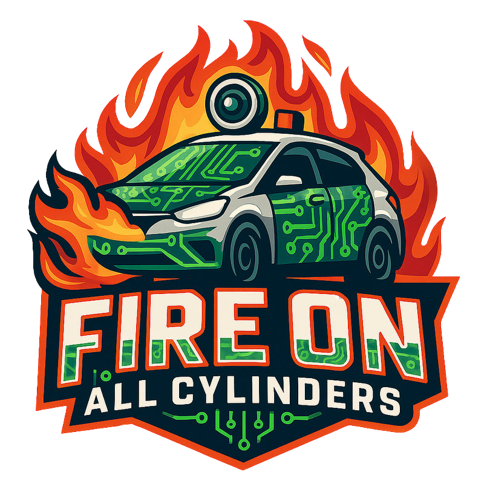
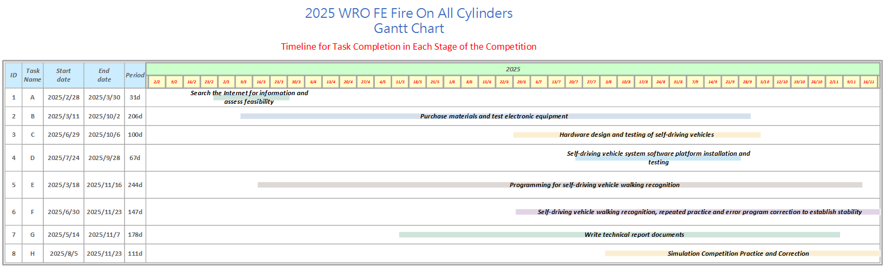

 

### 中文
- 這是 WRO 台灣隊伍「__Fire On All Cylinders.__」的官方  
- 您可以在此處找到技術報告內容和設定說明的鏈接，這些鏈接分別面向學習者和評委，方便您在學習或評估期間訪問。
- 本技術文件將根據評分標準建立目錄，目錄標題將以超連結形式顯示，方便評審或學習者輕鬆導航至技術文件的關鍵內容，從而快速進行評估。
- **特別提醒：**受網路速度影響，圖片可能無法正常顯示。如遇此情況，請嘗試重新整理網頁以解決問題。
### 英文
- This is the official GitHub repository of the WRO Taiwan team "__Fire On All Cylinders.__". All code, files and documents are here.
- You can find links to the technical report content and setting instructions here, which are for learners and judges respectively, for your convenience during learning or evaluation.
- This technical document will establish a table of contents according to the scoring criteria, and the table of contents titles will be displayed in the form of hyperlinks, so that judges or learners can easily navigate to the key content of the technical document for quick evaluation.
- **Special reminder: **Due to the network speed, the image may not be displayed properly. If this happens, please try to refresh the webpage to solve the problem.
    #### [For Learners](learners_contents.md)

## Rubric for Judging Engineering Documentation-工程文獻評審標準

- ###  ${{\color{red} Hardware Overview }} $ 
  #### 1. Mobility Management-行動管理
    * [1-1 Vehicle 2D/3D Models in CAD (CAD 中的車輛 2D/3D 模型) **已改動OK](models/Vehicle_2D_3D/README.md)
    * [1-2 Vehicle Chassis Design(車輛底盤設計) **已改動OK](schemes/Vehicle_Chassis_Design/README.md)
    * [1-3 Motor Selection (馬達選擇)OK](schemes/Motor/README.md)
  #### 2. Power and Sense Management-電源和感測管理
    - __2-1 Vehicle Design__
      - [2-1-1 BOM Pats List (BOM零件清單) **已改動OK](schemes/Parts_List/README.md)
      - [2-1-2 Circuit Design (電路設計) **已改動 OK](models/Circuit_Design/README.md)
      - [2-1-3 Hardware Fool-Proof Design(硬體防呆設計)OK ](schemes/Fool-Proof-Design/README.md)
      - [2-1-4 Assembly Instructions & Wiring Diagrams(裝配說明和接線圖) OK](schemes/Assembly_Instructions/README.md)
    - __2-2 Power Management-電源管理__
      - [2-2-1 Battery choice for self-driving cars(自動駕駛汽車的電池選擇) OK](schemes/Battery/README.md)
      - [2-2-2 Power Supply System(供電系統) OK](schemes/Power_Supply_System/README.md)
    - __2-3 Controller Selection-控制器選擇__
      - [2-3-1 Main Controller Comparison(主控制器對比) **已改動 OK](schemes/Main_Controller_Choosing/README.md)
      - [2-3-2 Motor & Sensor Intermediate I/O Controller Comparison(馬達和感測器中間 I/O 控制器比較) **已改動 OK](schemes/Motor_Sensor_Controller_Choosing/README.md)
    - __2-4 Sense Management-感知管理__
      - [2-4-1 Ultrasonic rangefinder(超音波測距儀) **已改動 OK](schemes/HC-SR04/README.md)
      - [2-4-2 Infrared Sensor(紅外線感測器) **已改動 OK](schemes/Infrared-Sensor/README.md)
      - [2-4-3 Gyroscope orientation sensor(陀螺儀方向感應器) **已改動 OK](schemes/BNO055/README.md)
      - [2-4-4 Camera Selection(相機選擇) OK](schemes/Camera/README.md)

- ### ${{\color{red} Software Overview }} $ 
  #### 3. Obstacle Management-障礙管理
    - [3-1 Software Platform Construction(軟體平台建設) **已改動OK](src/System_Platform_Software/README.md)
    - [3-2 OpenCV Introduction (OpenCV介紹)](src/OpenCV/README.md)
    - __3-4 Image Recognition Processing and Steering-影像辨識處理和控制__
      - [3-4-1 Image Recognition Processing(影像辨識處理) **已改動 OK](src/Image_Recognition_Processing/README.md)
      - [3-4-2 Parking Lot Departure Steering Control Overview(停車場出發轉向控制) **已改動 OK](src/Overview_of_Parking_Lot_Departure_Steering_Control/README.md) 
      - [3-4-3 Steering Control(轉向控制) ](src/Steering_Control/README.md) 
      - [3-4-4 Automatically record the LAB values of the field(場地物件LAB值的自動化儲存記錄) **已改動OK](src/Automatically_record_LAB/README.md)
    - __3-5 Programming - Vehicle’s control program程式設計__
      - [3-5-1 Open Challenge Code Overview(開放挑戰程式碼概述) ](src/Programming/Open_Challenge/README.md)
      - [3-5-2 Obstacle Challenge Code Overview(障礙挑戰代碼概述) ](src/Programming/Obstacle_Challenge/README.md)
      - [3-5-3 Distinctive Pseudo Code(獨特的偽代碼) ](src/Distinctive_Pseudo_Code/README.md)
      - [3-5-4 Departure Guide(出發指南) ](src/DepartureGuide/README.md)
      - [3-5-5 Parking Instruction(停車指南) ](src/parking/README.md)
    - __3-6 Remote Connection-遠端連線__
      - [3-6-1 NoMachine Introduction(NoMachine簡介) OK](other/NoMachine/README.md)

- ### ${{\color{red} Other}} $
  #### 4. Pictures – Team and Vehicle-圖片 – 車隊和車輛
    - [4-1 Team Members Introduction (團隊成員介紹)OK](t-photos/README.md)
    - [4-2 Vehicle Photos OK](v-photos/README.md)  
  #### 5. Performance Videos - Challenge rounds 表演影片
    - [5-1 Open Challenge rounds(公開挑戰) OK](video/Open_Challenge/video.md)
    - [5-2 Obstacle Challenge rounds (障礙挑戰)OK](video/Obstacle_Challenge/video.md)
    - [5-3 Self-Driving Car Design Process Video](video/Design_Process_Video/video.md)
  #### 6. GitHub Utilization-GitHub 使用率
    - [6-1 GitHub Editing Tools Introduction(VScode Edit/GIT) (GitHub 編輯VScode 編輯/GIT)OK](src/GitHub_Edit/README.md)
    - [6-2 GitHub Web Editor Supported Markup Languages(GitHub 網頁編輯支援的標記語言)OK ](src/GitHub_Languages/README.md)  
  #### 7. Engineering Factor -工程因素 
    - [7-1 Work Diary(工作日記) **已改動](other/work_diary/README.md)
      - [February (二月)](other/work_diary/README.md#20250228--20250330)
      - [March (三月)](other/work_diary/README.md#20250301--20250307)
      - [April (四月)](other/work_diary/README.md#20250403--20250414)
      - [May (五月)](other/work_diary/README.md#20250501--20250507)
      - [June (六月)](other/work_diary/README.md#20250604--20250608)
      - [July (七月)](other/work_diary/README.md#20250702--20250721)
      - [August (八月)](other/work_diary/README.md#20250818--20250824)
      - [September (九月)](other/work_diary/README.md#20250901--20250906)
      - [October (十月)](other/work_diary/README.md#20250928--20251006)

- ### 自動駕駛汽車設計：關鍵升級與迭代
  這款自動駕駛汽車設計建立在從前輩團隊（Shinan-Fire-On-All-Cylinders ）繼承的豐富經驗之上，並融入了我去年參加世界大賽的實踐經驗。
  我們不僅借鑒了上一年冠軍隊伍的成功要素，還實施了關鍵的技術迭代：
  * **控制器升級：**主控制器已從標準的 Jetson Orin Nano 升級為性能更優越的 Nvidia Jetson Orin Nano。
* **機械大修：**我們對車輛的機械部件進行了重組和優化，特別是轉向系統和底盤。
* **視覺增強：**影像處理能力得到了顯著提升，效率和準確性更高。

  所有這些升級和創新設計元素的整合，其目的就是要全面提升車輛的整體性能和競爭力。

- ### Autonomous Vehicle Design: Key Upgrades and Iterations
  This autonomous vehicle design **builds upon** the rich experience inherited from the senior team (**Shinan-Fire-On-All-Cylinders**) and integrates my practical insights from last year's World Competition.

  We didn't just reference the successful elements of the previous year's winning teams; we implemented **key technological iterations**:

  * **Controller Upgrade:** The main controller has been upgraded from the standard Jetson Orin Nano to the **superior-performing Nvidia Jetson Orin Nano**.
  * **Mechanical Overhaul:** We have **restructured and optimized** the vehicle's mechanical components, specifically the steering and chassis.
  * **Vision Enhancement:** Image processing has been **significantly enhanced** for greater efficiency and accuracy.

  The integration of all these upgrades and innovative design elements is squarely aimed at **comprehensively strengthening** the vehicle's overall performance and competitiveness.
  

 
