

 ## 
 Circuit Design -電路設計

- 在我們的**自駕車**電路板設計過程中，我們選用了 **EasyEDA** 這款擁有**直覺式圖形介面**的專業電路設計軟體。藉由這項工具，我們**顯著提升**了焊接工作的**準確性**與接線的**精確度**，從而**有效地降低**了製造過程中的錯誤率，並將元件**燒毀的風險**控制在最低。

- 我們採取了**專業的印刷電路板 (PCB) 製作方式**（即「洗電路板」）。此舉不僅**大幅減少**了焊接錯誤和短路的**潛在風險**，更**優化了成品的外觀品質**。同時，這種製造方法提供了**更高的製程靈活性**與**操作上的便利性**。

- 該電路板的**核心功能**在於為**整合**的各類**感測器**、**馬達**以及**上下層控制器**提供穩定可靠的**電力供應**與**訊號傳輸介面**。這確保了所有關鍵電子元件之間能夠實現**順暢的通訊**與**高效的協同運作**，為**車輛控制程式**的運行奠定堅實基礎。

- In the design process of our **Self-Driving Car** circuit board, we utilized **EasyEDA**, a professional circuit design software featuring an **intuitive graphical interface**. Through this tool, we have **significantly enhanced** the **accuracy** of soldering and the **precision** of wiring, thereby **effectively reducing** the error rate during the manufacturing process, and minimizing the **risk of component burnout**.

- We adopted a **professional Printed Circuit Board (PCB) manufacturing method** (i.e., "PCB etching/fabrication"). This approach has not only **substantially mitigated** the **potential risks** of soldering errors and short circuits but has also **improved the aesthetic quality of the finished product**. Concurrently, this manufacturing technique offers **greater process flexibility** and **operational convenience**.

- The **core function** of this circuit board is to provide a stable and reliable **power supply** and **signal transmission interface** for the **integrated** various **sensors**, **motors**, and the **upper and lower layer controllers**. This ensures that all critical electronic components can achieve **smooth communication** and **efficient collaborative operation**, laying a solid foundation for the execution of the **Vehicle's control program**.

 - ### The Process of Identifying and Correcting Physical Circuit Board Design Issues - 實體電路板設計問題之發現與修正歷程
   - ### Circuit Board Design Version History - 電路板設計版本 (Version) 歷程

<table>
   <tr>
      <th colspan=3 >V1.0 (Pegboard)</th>
   </tr>
   <tr>
      <td align=center  width="25%"></td>
      <td align=center  width="25%"></td>
   <td>

   __Description:__          

   - 此版本採用電木板作為電路設計材料 ，其設計和焊接過程極為耗時 。同時，線路佈局雜亂且缺乏美觀性 。這不僅大幅提高了除錯與故障診斷的難度 ，更潛藏了焊接不良、虛焊（假焊）以及短路的重大風險 。
   - This version utilizes a PCB pegboard (or Bakelite board) as the material for circuit design , making the design and soldering process exceedingly time-consuming. Furthermore, the circuit layout is disorganized and lacks aesthetic quality. This deficiency not only significantly increases the difficulty of debugging and troubleshooting but also poses substantial risks of poor solder joints, cold joints (or pseudo-soldering), and short circuits.
               
   </td>
   </tr>
   <tr>
      <th colspan=3>V2.0 (PCB)</th>
   </tr>
   <tr>
      <td align=center width="25%" >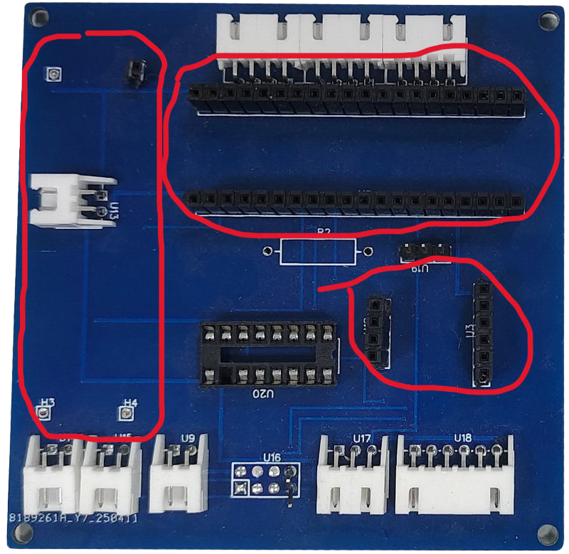</td>
       <td align=center  width="25%">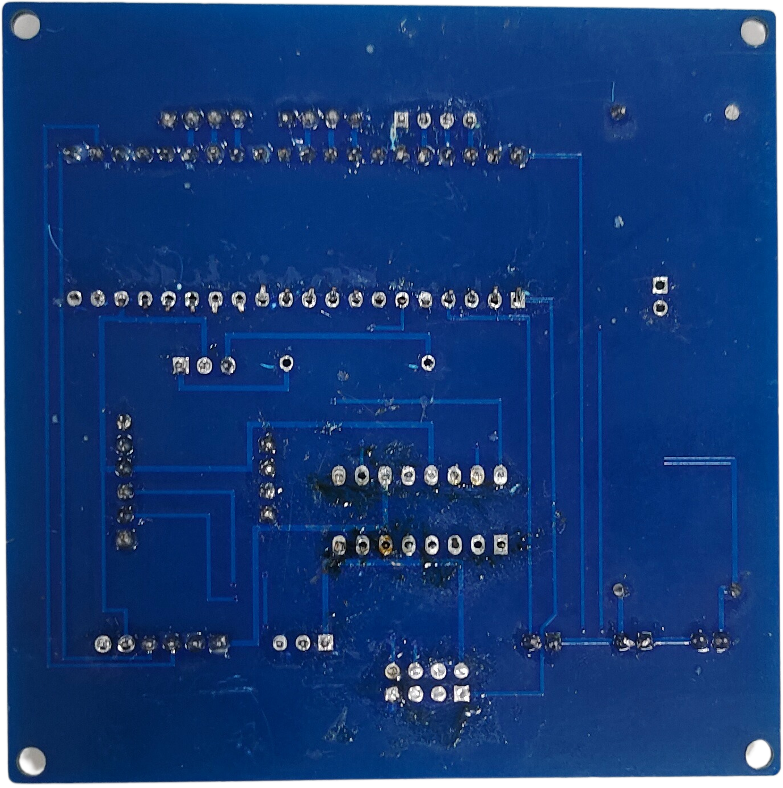</td>
      <td>

   __Description:__
            
   - 為了解決舊版本電路板(V1.0)設計中的問題，我們決定使用 EasyEDA 軟體來繪製電路，並生成 PCB 電路圖(V2.0)，送交工廠進行印刷製作。這次經驗讓我們成功學習到如何設計出符合業界標準的印刷電路板。

   - 當我們拿到製作完成的印刷電路板(V2.0)時，感到十分興奮。然而，在安裝電子元件的過程中，卻發現元件無法順利組裝。經檢查後確認，這是因為我們在設計時錯誤地設定了針腳插座間距所導致。

   - To address the issues in the previous version's circuit board design, we decided to use the EasyEDA software to design the circuit and generate the PCB schematic, which was then sent to a factory for printing and manufacturing. This experience allowed us to learn how to design a printed circuit board that meets industry standards.

   - We were very excited upon receiving the finished printed circuit boards. However, during the process of installing the electronic components, we discovered that the components could not be successfully assembled. Upon inspection, we confirmed that this issue was caused by an incorrectly designed pin socket pitch in our layout.
            
   </td>
   </tr>
   <tr>
      <th colspan=3>V3.0 (PCB)</th>
   </tr>
   <tr>
      <td align=center width="25%">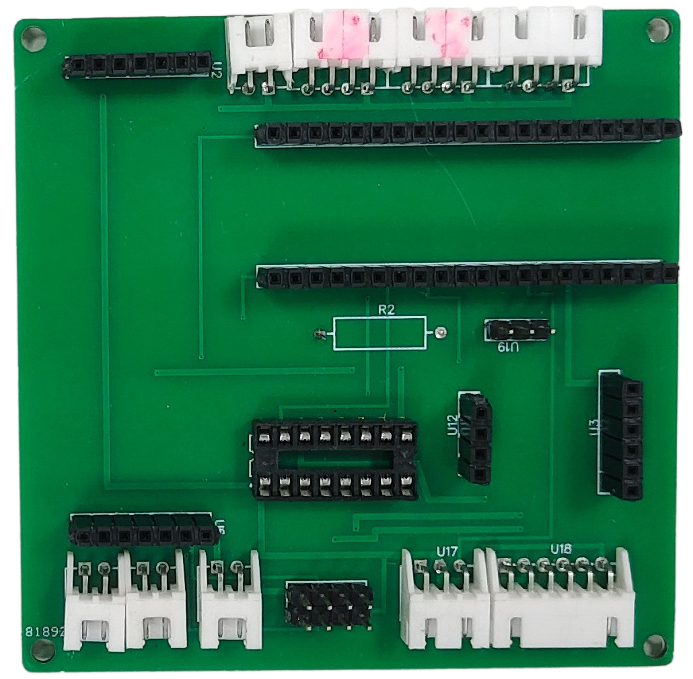</td>
      <td align=center width="25%">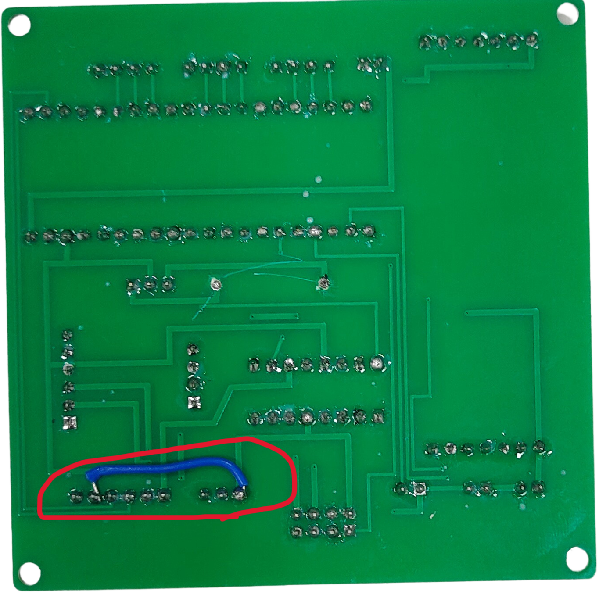</td>
   <td>

   __Description:__
      
   - 鑑於上一版印刷電路板(V2.0)出現針腳間距錯誤的問題，我們利用 EasyEDA 軟體內建的標準範例圖進行參照，精確地重新校準了正確的針腳間距參數，送工廠製作。

   - 然而拿到製作完成的印刷電路板(V3.0)時，在後續的功能測試環節中，我們發現整個電路的極性呈現反向。經過詳細的檢查與追溯，最終確認問題是源於電路板設計階段的操作失誤，即誤將電路板的背面佈局層繪製到了正面。

   - Given the issue of incorrect pin pitch present in the previous PCB version, we utilized the standard built-in example layouts of the EasyEDA software as a reference to accurately re-calibrate the correct pin pitch parameters.

   - However, during the subsequent functional testing phase, we detected that the overall circuit polarity was inverted. Following a detailed inspection and root cause analysis, we confirmed that the problem arose from a procedural error during the PCB design stage, specifically mistakenly drawing the board's backside layout layer onto the front side.

            
   </td>
   </tr>
   <tr>
       <th colspan=3>V4.0 (PCB)</th>
   </tr>
    <tr>
      <td align=center  width="25%">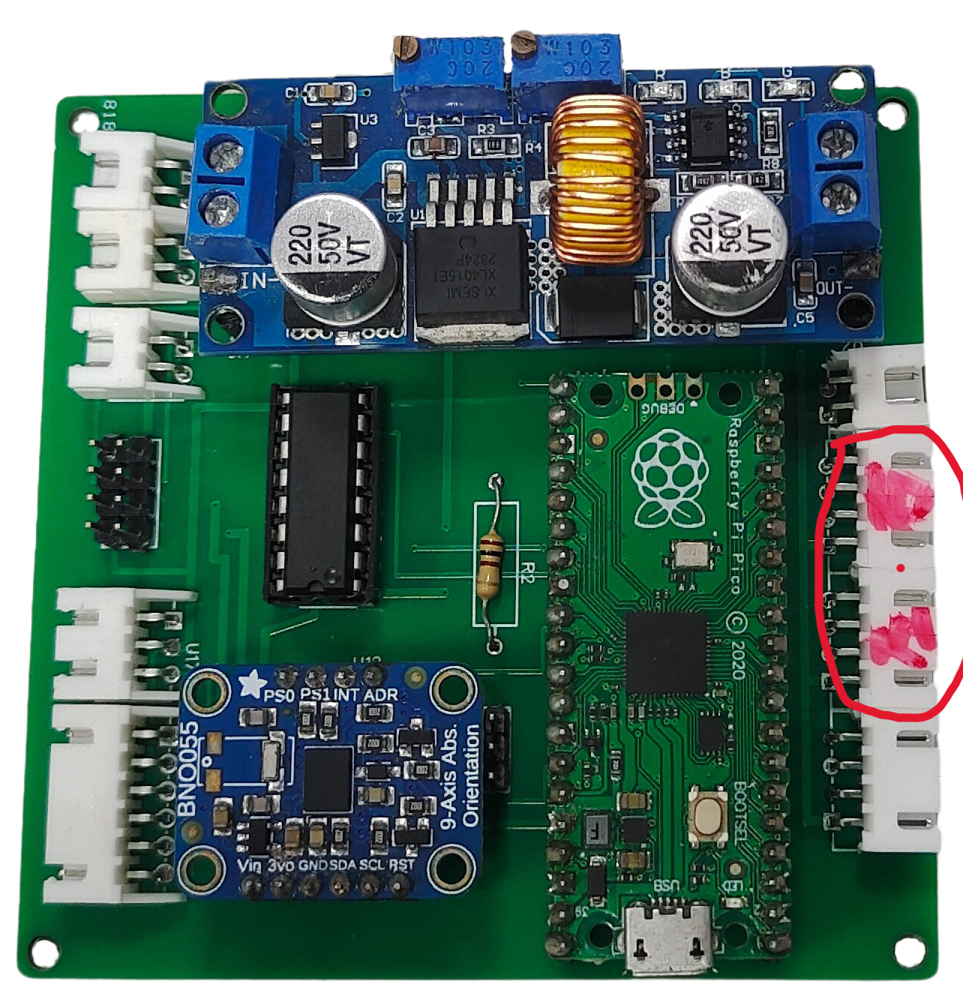</td>
      <td align=center width="25%">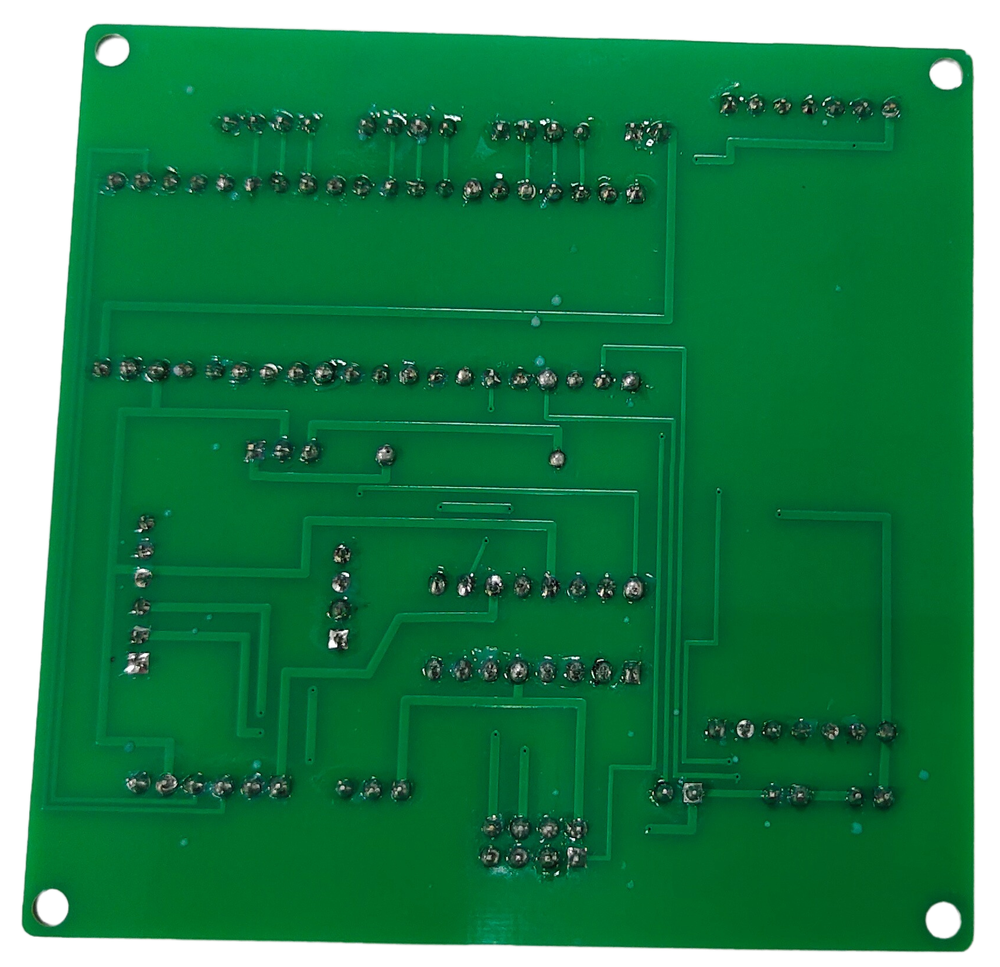</td>
   <td>

   __Description:__

   - 由於上一版印刷電路板(V3.0)存在電路極性顛倒的問題，我們對電路圖進行了重新繪製，並經過多次嚴格確認繪圖無誤後，才將檔案送出製作，得到印刷電路板(V4.0)。

   - 由於我們將機器人主控制器升級為 Jetson Orin Nano，並改用紅外線感測器來偵測是否靠近停-車區牆面，因此需要在電路板上增設兩個 2 Pin 的母頭插座，同時為 Jetson Orin Nano 設計可插拔式接線端子以提供電源連接點，只好重新設計送工廠重新印刷電路板(V5.0)。

   - Due to the issue of inverted circuit polarity in the previous PCB version, we re-drew the circuit diagram and sent the file for manufacturing only after multiple rigorous checks confirmed the drawing's accuracy.

   - As we upgraded the robot's main controller to the Jetson Orin Nano and switched to using infrared sensors to detect proximity to the parking zone walls, it was necessary to add two 2-pin female headers to the PCB and design pluggable terminal blocks for the Jetson Orin Nano to provide power connection points.

   </td>
   </tr>
   <tr>
      <th colspan=3>V5.0 (PCB)</th>
   </tr>
   <tr>
      <td align=center width="25%" >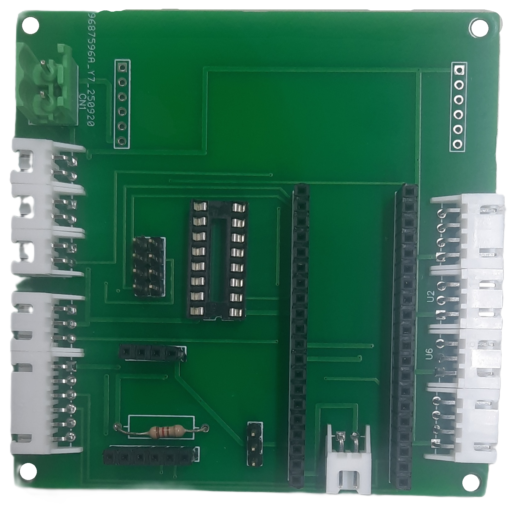</td>
      <td align=center width="25%"></td>
   <td>
      
   __Description:__

   - 拿到新的印刷電路板(V5.0)，在測試過程中，在讀取陀螺儀角度時，會有讀取數值為0的狀況，經過排查發現是陀螺儀感測器的電源正負極接在Raspberry Pi Pico W提供的電源，但陀螺儀感測器的訊線線卻接在Jetson Orin Nano控制器上，造成電源與信號源是不同迴路，因此產生誤動作，所以修改陀螺儀感測器的電源與信號源均由Jetson Orin Nano控制器提供。
   - 另外，因應規則規定，需要由Jetson Orin Nano偵測啟動按鈕是否按下，才能動作，因此將按鈕電路獨立連接到Jetson orin nano的GPIO接口，並且新增RGB燈珠用於顯示當下看到最近物件顏色，因此新增第二塊電路板用於自駕車啟動按鈕控制電路。
   </td>
   </tr>
     </table>  
  

     <table>
   <tr>
       <th colspan=4>Final(PCB)</th>
   </tr>
   <tr>
      <td align=center width="25%"></td>
      <td align=center width="25%"></td>   
      <td align=center width="25%"></td>
      <td align=center width="25%">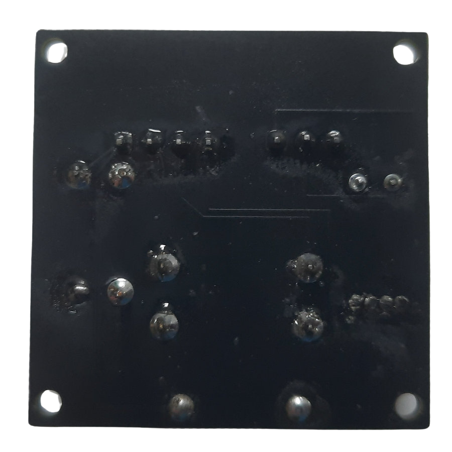</td>
   </tr>
      </table>

 - ### Circuit Schematic Drawing 電路原理圖
 

   <table>
      <tr>
         <th>3D view</th>
         <th>circuit schematic</th>
         <th>PBC layout drawing</th>
      </tr>
      <tr>
         <td align=center >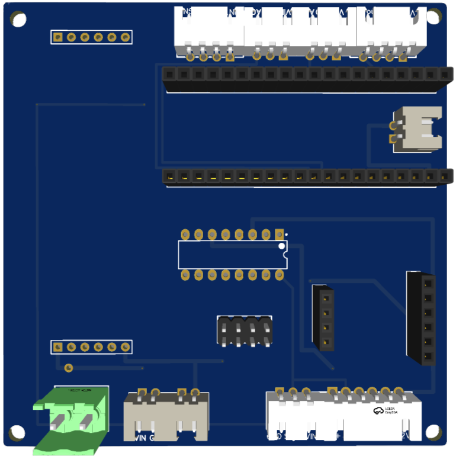</td>
         <td align=center >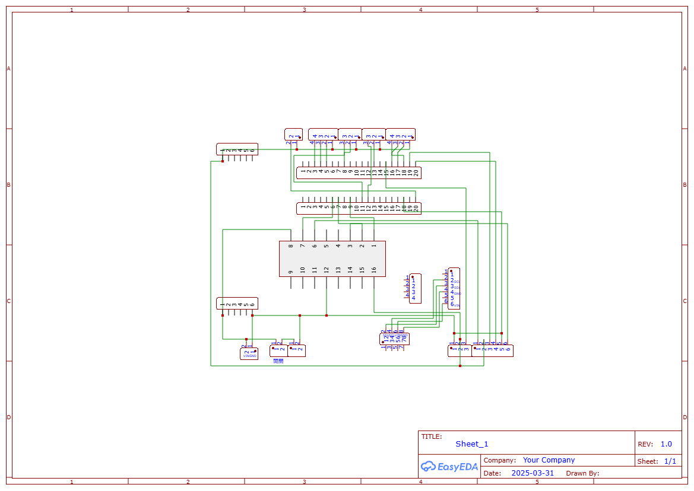</td>
         <td align=center >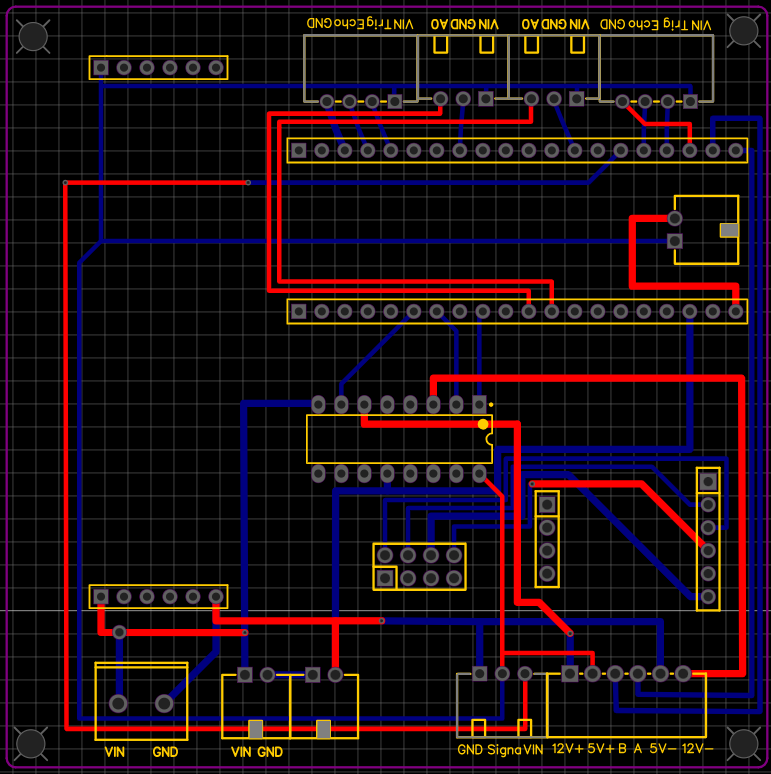</td>
      </tr>
      <tr>
         <td align=center ></td>
         <td align=center ></td>
         <td align=center ></td>
      </tr>
   </table>
   <table>
   <th align=center>	Overall circuit schematic  </th>
   <tr>
   <td align=center >
   </td>
   </tr>
   </table>
 
 

 ***
 - ### Supplementary Information -補充資訊
 
 - #### 經驗分享-Adafruit BNO055 電路
   

 #### 中文
   在自駕車電路設計的初始版本中，Adafruit BNO055 IMU感測器正極由Raspberry Pi Pico W提供，而資料傳輸是連接到Jetson Orin Nano。然而由於該設計未能形成完整電源迴路，導致系統缺乏統一電位基準，進而造成感測數據異常，尤其航向角輸出長時間固定於0°，無法反映實際姿態變化。
   
   為解決此問題，設計方案改以 Jetson Orin Nano 提供 BNO055 的正極電源，並將地線直接連接至 Orin 之 GND 腳位，以確保電源迴路閉合並建立穩定的電位基準。經過此調整後，感測器數據恢復正常，航向角能隨著車體旋轉而準確變化，滿足自駕車定位與導航控制之需求。

 - #### EasyEDA Introduction  -EasyEDA 簡介
 #### 中文:
   __EasyEDA__ 是一款免費的線上電子設計自動化（EDA）軟體，可用於設計與模擬電子電路，以及製作印刷電路板（PCB）。它提供簡單且使用者友善的圖形介面，具備多種功能，非常適合電子愛好者與專業工程師使用。
   - EasyEDA 可直接在網頁瀏覽器中使用，無需安裝軟體，因此具備跨平台的可用性。它支援電路設計、模擬、PCB 製作，並允許團隊共同協作進行電子專案。
   #### 英文:

   __EasyEDA__ is a free online Electronic Design Automation (EDA) software used for designing, simulating electronic circuits, and creating printed circuit boards (PCBs). It offers a simple and user-friendly graphical interface, with a variety of features that make it ideal for both hobbyists and professional engineers.
   - EasyEDA can be used directly in a web browser without the need for software installation, making it cross-platform accessible. It supports circuit design, simulation, PCB creation, and also allows teams to collaborate on electronic projects.

   - ### __EasyEDA的主要功能包括：__

   - ### The main features of EasyEDA include:

   
   #### 中文:
   
   - 電路圖設計： 使用其豐富的元件庫設計電路圖，該元件庫包含電阻器、电容器、電晶體、積體電路（IC）等多種元件。
   - PCB 設計： 支援多層 PCB 設計，並提供自動佈線功能，協助使用者高效率地完成電路板佈局。
   - 內建的 SPICE 模擬功能可讓使用者在製造前先行虛擬測試電路。
   - 元件庫： 提供大量的元件庫，並支援從其他 CAD 工具匯入元件，或自行建立自訂元件。
   - 協作工具： 使用者可以與團隊成員共享設計圖，以進行協同作業。
   - 雲端儲存： 設計檔案可儲存在雲端，方便隨時隨地存取與修改，也有助於與團隊成員之間的協作。
   - 製造整合： EasyEDA 與 JLCPCB 無縫整合，使用者可直接提交設計進行生產，輕鬆訂購客製化的 PCB。

   #### 英文:
   - Schematic Design: Design circuit diagrams using its extensive component library, which includes resistors, capacitors, transistors, integrated circuits (ICs), and more.Schematic Design: Design circuit diagrams using its extensive component library, which includes resistors, capacitors, transistors, integrated circuits (ICs), and more.
   - PCB Design: Supports multi-layer PCB design and provides an auto-routing feature to help users efficiently layout their boards.
   - Simulation: Built-in SPICE simulation allows users to virtually test circuits before manufacturing.
   - Component Library: Offers a vast component library and supports importing parts from other CAD tools or creating custom components.
   - Collaboration Tools: Allows users to share designs with teammates for collaborative work.
   - Cloud Storage: Design files can be saved in the cloud, making it easy to modify and access from anywhere, as well as facilitating collaboration with team members.
   - Manufacturing Integration: EasyEDA is seamlessly integrated with JLCPCB, allowing users to directly submit designs for production and easily order custom PCBs.
   ### Summarize -總結
   #### 中文:
   整體而言，EasyEDA 是一款功能強大且操作簡便的電子設計工具。無論是初學者還是專業工程師，它都能提供符合需求的各項功能。其雲端可存取性、簡單的操作介面，以及與製造商的整合，使其成為設計與製作電子電路的絕佳選擇。
#### 英文:
   __Overall, EasyEDA is a powerful and easy-to-use tool for electronic design. Whether you're a beginner or a professional engineer, it offers features to meet your needs. Its cloud-based accessibility, simple operation, and integration with manufacturers make it an excellent choice for designing and producing electronic circuits.__

   - Software link：[EasyEDA](https://easyeda.com/)
 

    <table>
    <tr>
    <th>EasyEDA of Official website.</th>
    <th>Schematic Design</th>
    </tr><tr>
    <td></td>
    <td>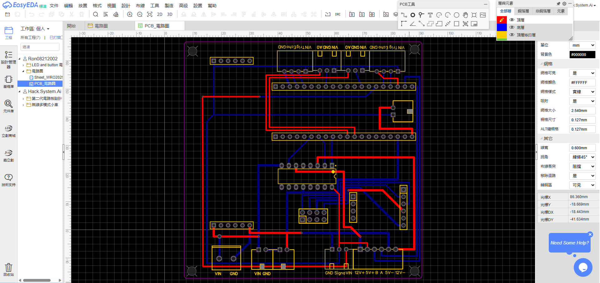</td>
    </tr>
    </table>
    

# 
[Return Home](../../)
  
