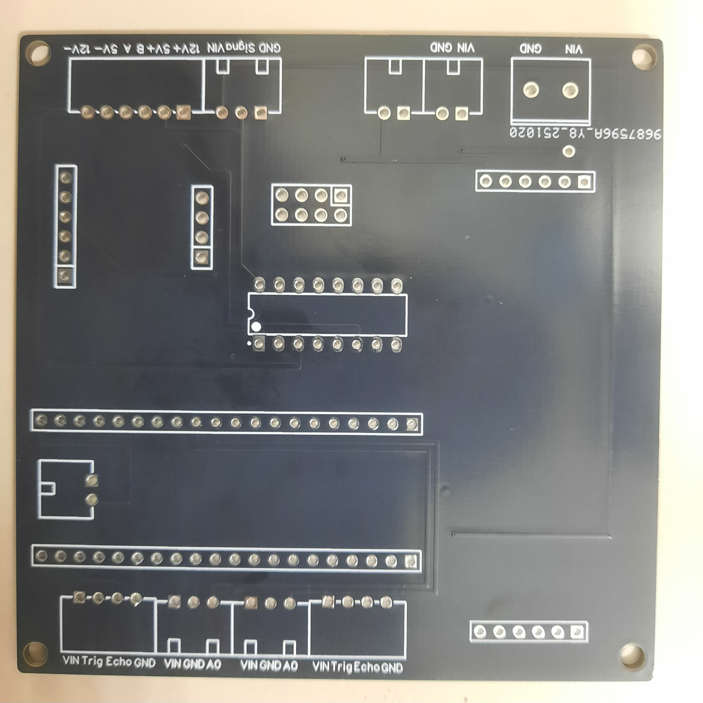
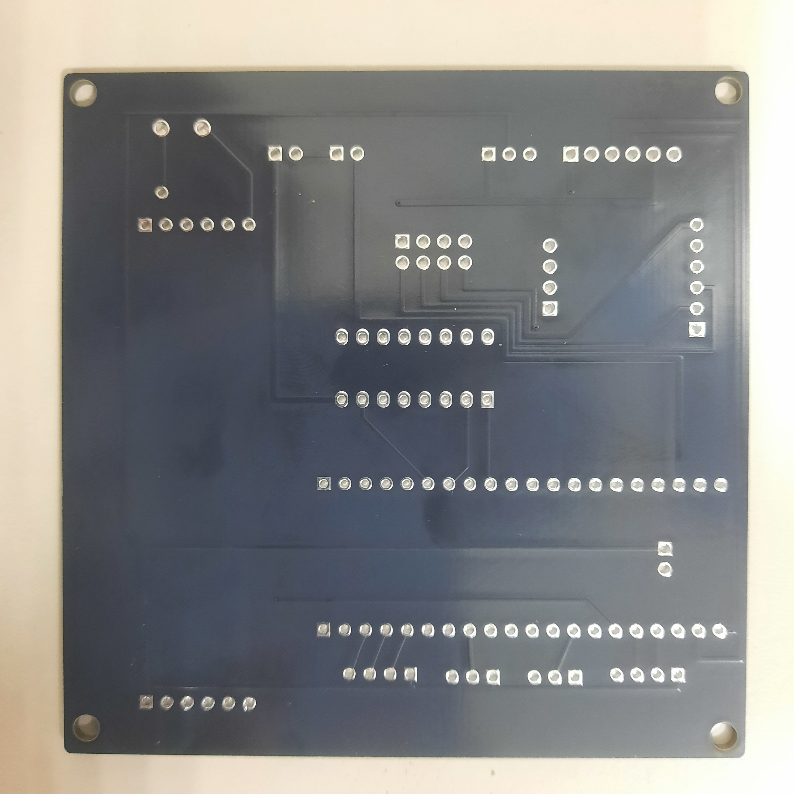
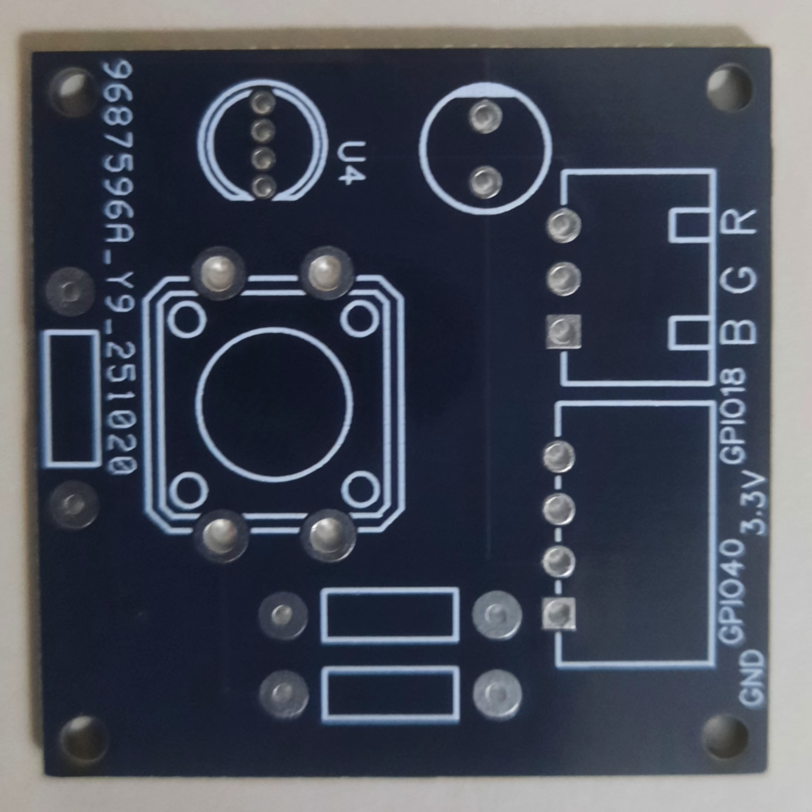
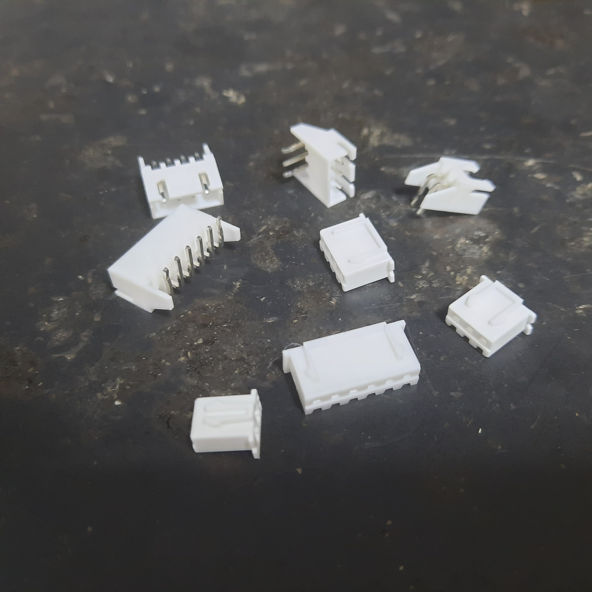
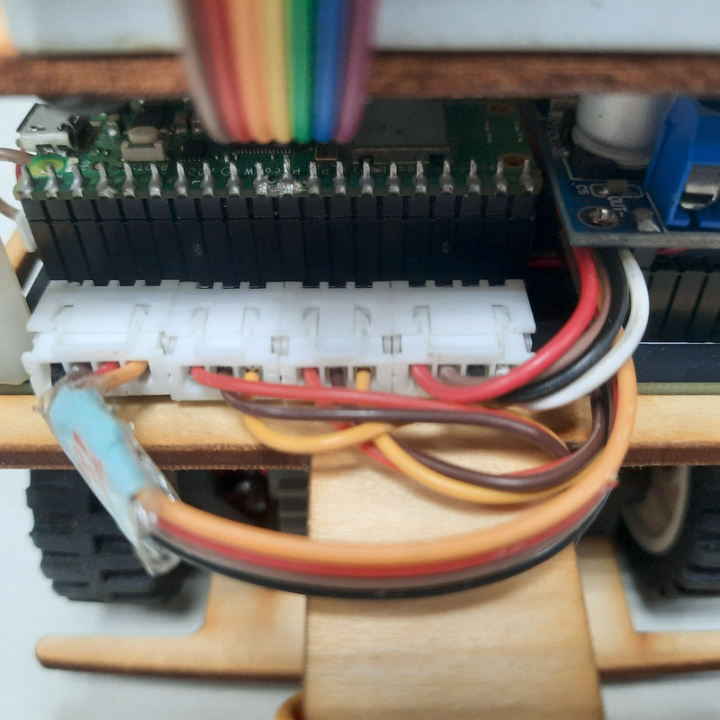

## 
Hardware Fool-Proof Design-硬體防呆設計

### 中文:
在實際硬體設計過程中，我們經常遇到電源與訊號線接錯，導致 Jetson Orin Nano、IC 或感測器等元件損壞。為避免此類問題，我們改用公母插頭連接電源與訊號線，並將接頭元件焊接在設計完成的 PCB 電路板上。此改進有效降低了元件燒毀的風險，提升系統穩定性，並增強產品的可靠性與使用壽命。

此外，我們新增了 __插拔式接線端子__ 作為 __Jetson Orin Nano__ 的電源供應介面。之所以選用此元件，是因為 Jetson Orin Nano 不支援從 5V 腳位反向供電，而若將電源線直接接在降壓模組上，則容易因接觸鬆脫而造成主板損壞。因此，我們採用插拔式接線端子作為電源供應線的連接介面，不僅能確保連接穩固、提升整體安全性，並且方便在維修或測試時排除錯誤。

    <table>
        <tr>
            <th>Pluggable Terminal Block</th>
            <th>Circuit real-life photo</th>
        </tr>
        <tr align=center>
            <td></td>
            <td></td>
        </tr>
    </table>

    <table>
        <tr>
            <th width=500>PCB 電路板正面(主)</th>
            <th width=500>PCB 電路板正反(主)</th>
        </tr>
        <tr align=center>
            <td></td>
            <td></td>
        </tr>
        <tr>
            <th>PCB LED和Button電路板正面</th>
            <th>PCB LED和Button電路板反面</th>
        </tr>
        <tr align=center>
            <td></td>
            <td></td>
        </tr>
    </table>

<table>
<tr>
<th>2.5mm Connector 2/3 Pin Male/female Adapter Right Angle Pin Header White Socket(2.5毫米接頭 2/3 針公母轉接頭 直角針腳 白色插座)</th>
<th>Circuit real-life photo(電路實際照片)</th>
</tr><tr>
<td width=500 align=center></td> 
<td width=500 align=center></td> 
</tr>
</table>

# 
[Return Home](../../)
  
