

## 
Vehicle Chassis Design Process-車輛底盤設計過程
 

- ### Vehicle Chassis Design-車輛底盤設計
    __硬體設計理念與底盤架構優化__
  1.  **設計傳承與創新：** 本次 **自駕車**（Self-Driving-Cars）的軟硬體設計靈感延續了去年的機型，並**借鑑了去年世界冠軍車型**的優點。在此基礎上，我們將主控制器從 **Nvidia Jetson Nano 升級為 Nvidia Jetson Orin Nano**，此舉不僅顯著提升了整體運算性能，更為引入創新的軟體設計提供了堅實基礎，使車輛具備更強的競爭力。
  2.  **核心元件自主性：** 本次比賽所使用的**車輛底盤**為完全**自主設計與開發**。
  3.  **轉向幾何改良：** 底盤結構採用了工程上常見的 **Ackermann 轉向幾何**（Ackermann Steering Geometry）。更重要的是，我們針對**去年機構的缺點進行了改良**，使車輛在執行**避障**及**迴轉動作**時能夠更加平穩順暢。

    __Hardware Design Philosophy and Chassis Optimization__
  1.  **Design Legacy and Innovation:** The software and hardware design of this **Self-Driving Car** continues the inspiration from last year's model while **drawing upon the strengths of last year's world champion vehicle design**. Building on this foundation, we upgraded the main controller from the **Nvidia Jetson Nano to the Nvidia Jetson Orin Nano**. This move not only significantly enhances the overall computational performance but also provides a robust basis for introducing innovative software designs, making the vehicle more competitive.
  2.  **Autonomy of Core Components:** The **vehicle chassis** used in this competition was **independently designed and developed** by our team.
  3.  **Steering Geometry Improvement:** The chassis structure utilizes the common engineering principle of **Ackermann Steering Geometry**. Crucially, we implemented **improvements based on the shortcomings of last year's mechanism**, ensuring the vehicle performs **obstacle avoidance** and **turning maneuvers** with greater stability and smoothness.

  - 下表展示了車輛底盤的3D模型與實體成品。
  - **The following table shows the 3D models and finished products of the vehicle chassis.** 
    |3D Vehicle Chassis Design(3D 車輛底盤設計)| Vehicle Chassis Top View(車輛底盤俯視圖) | Vehicle Chassis Bottom View(車輛底盤底部視圖)|
    |:----:|:----:|:----:|
    |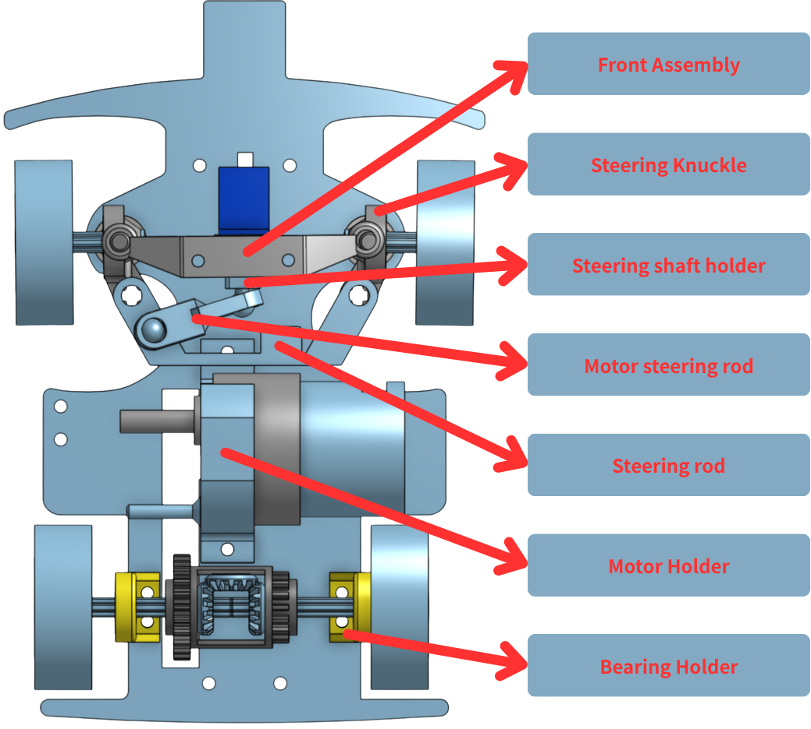|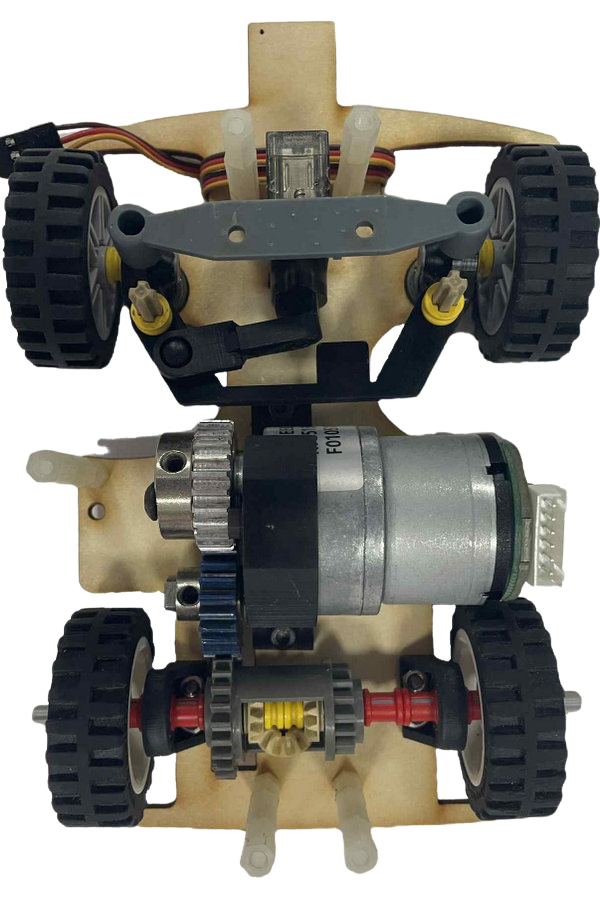|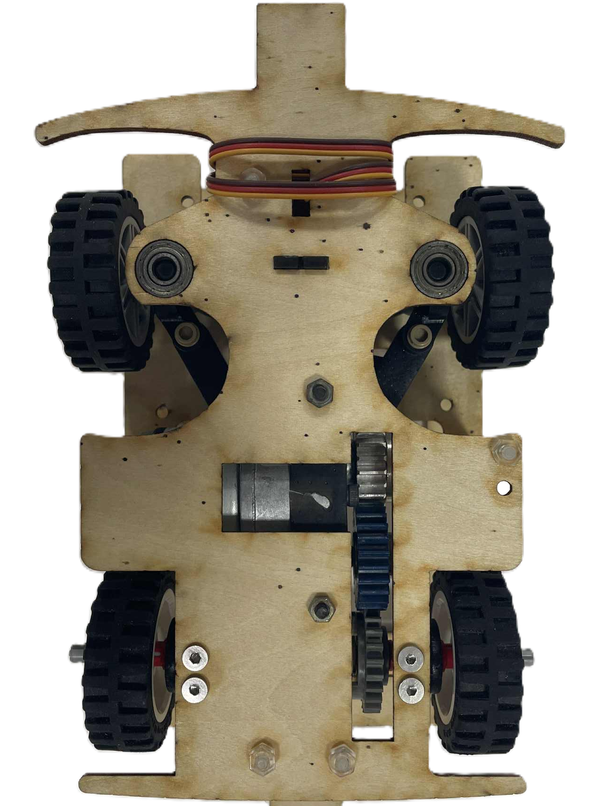|

    - 我們可以根據車輛的具體需求自訂零件的尺寸與形狀，並利用立體光刻（SLA）3D列印機與雷射切割機，設計並製造車輛底盤的所有零件，齒輪、樂高6376齒輪差速器及輪胎除外。
    - 為了降低軸承的旋轉摩擦，我們在車輛支架中整合了軸承，從而提升車輛的速度。
    - 為了精準控制車輛的最佳轉彎半徑並靈活調整Ackermann比率，我們利用立體光刻（SLA）3D列印機及3D建模技術，依照具體需求設計了裝配Ackermann轉向幾何結構的車輛支架。

    - We can customize the size and shape of parts according to the specific needs of the vehicle and use Stereolithography (SLA) 3D printers and laser cutters to design and manufacture all parts of the vehicle chassis, except for the gears, Lego 6573 Gear Differential and tires.
    - To reduce rotational friction of the shafts, we integrated bearings into the vehicle's support frame, thereby increasing the vehicle's speed.
    - To precisely control the vehicle's optimal turning radius and flexibly adjust the Ackermann ratio, we used Stereolithography (SLA) 3D printers and 3D modeling technology to design the support frame for the Ackermann steering geometry on the vehicle chassis based on specific requirements.

- #### Vehicle Chassis Improvement Record-車輛底盤改進紀錄

  ### __WRO International Competition Vehicle Prototype Comparison: Last Year vs. This Year__

  ### __WRO 國際賽 Vehicle 原型機規格對比：去年度與本年度__

  

  <table>
  <tr>
  <th width=50%>2024 Season Competition Self-Driving Car Prototype</th>
  <th width=50%>2025 WRO World Final Competition Prototype</th>
  </tr>
  <tr align=center>
  <td>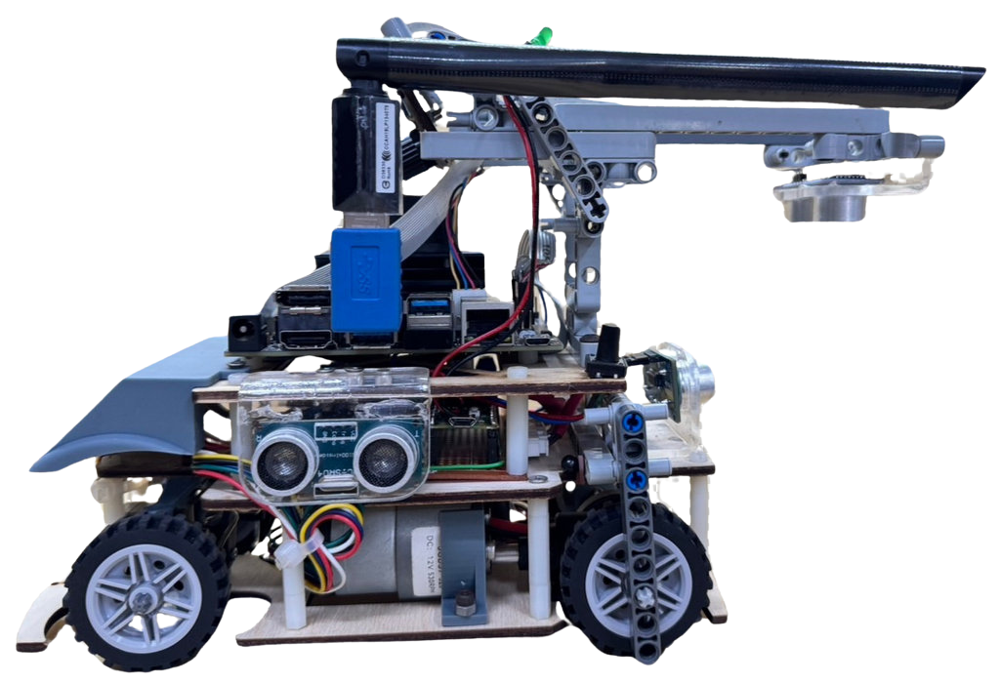</td>
  <td>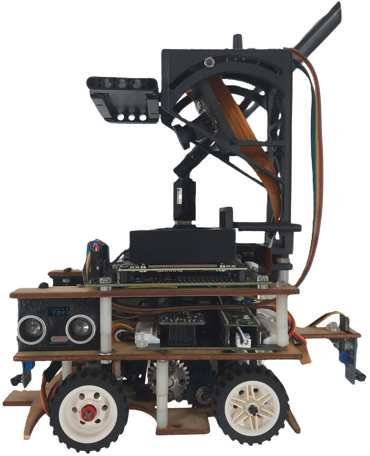</td>
  </tr>
  <tr>
  <th colspan=2>Explanation</th>
  </tr>
  <tr>
  <td colspan="2">
  Key Changes from Last Year's Version to This Year's International Competition Version：
  <ol>
  <li>The model's excessive length easily moves the blocks during obstacle avoidance, so we shortened the model's overall length.</li>
  <li>Redesigned the steering structure, the 2024 International Competition Vehicle Prototype used wire to link the two steering knuckles, which took up a larger area. Therefore, we used 3D-printed components for the redesign.</li>
  <li>During the national competition, we found that the computational efficiency of the Jetson Nano did not meet our requirements. Therefore, we replaced the main controller with the Jetson Orin Nano, which has higher computational efficiency.</li>
  <li>The Self-Driving-Car (Vehicle)'s steering angle was insufficient, resulting in the inability to pass some sharp turns. Therefore, we redesigned the steering structure to allow for a larger steering space.</li>
  <li>TCRT5000 infrared sensors were added to the front and rear of the Self-Driving-Car (Vehicle) to assist the execution of the parking procedure (parking lot).</li>
  <ol>
  </td>
  </tr>
  </table>
  

  

  <table>
  <tr>
  <th width=50%>2024 年國際賽機型</th>
  <th width=50%>2025 最終國際賽機型</th>
  </tr>
  <tr align=center>
  <td></td>
  <td></td>
  </tr>
  <tr>
  <th colspan=2>說明</th>
  </tr>
  <tr>
  <td colspan="2">
  從去年度版本到本年度國際賽版本的主要變更：
  <ol>
  <li>機型過長容易在避障時移動到方塊，因此我們縮短了機型整體長度。</li>
  <li>重新設計轉向結構，2024年國際賽機型使用鐵絲來連動兩側轉向節，面積較大。因此我們使用 3D 物件重新設計。</li>
  <li>在全國賽中我們發現 Jetson Nano 運算效率較不符合我們需求。因此我們將主控制器更換為運算效率更高的 Jetson Orin Nano。</li>
  <li>自駕車轉向角度不夠，導致一些急轉彎無法通過。因此我們重新設計轉向結構使其有更大的轉向空間。</li>
  <li>在自駕車前後方新增 TCRT5000 紅外感測器，用於輔助停車程序運行。</li>
  <ol>
  </td>
  </tr>
  </table>
  

 
  ### __Final Build-最終組裝__

  

  <table>
  <tr align=center>
  <th>
Photos of the final Build(最終組裝照片)</th>
  <th>
3D modeling of the final Build(最終組裝的3D建模)</th>
  <th>
Explanation(說明)</th>
  </tr><tr>
  <td width="30%"></td>
  <td width="30%">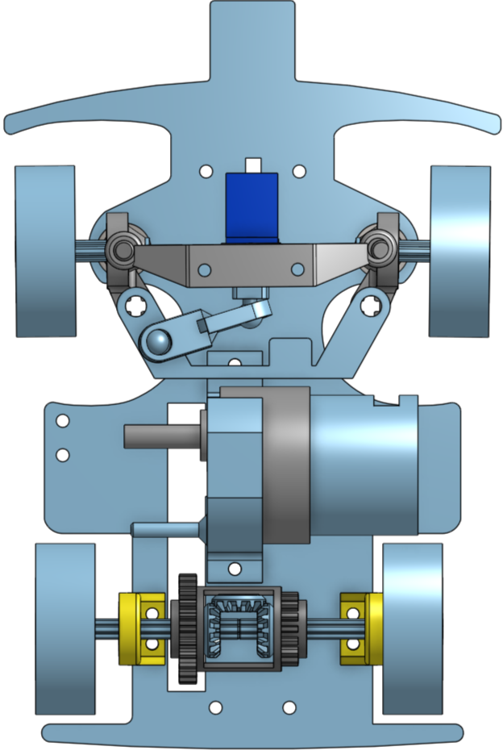</td>

  <td>
    我們在底盤的設計上經歷了四次改版
    <ol>
      <li>第一次改版我們在車頭加入弧形導角，避免前輪接觸邊牆時發生卡住的情況。</li>
      <li>第二版我們加大轉向節放置孔，改用軸承降低摩擦，使轉彎更順暢。</li>
      <li>第三版我們縮小轉向結構與馬達支架間的空隙，減短軸距以提升轉彎角度。</li>
      <li>第四版我們在車頭延伸出小長方區塊，用來保護紅外線感測器避免撞牆損壞。</li>
    </ol>
  </td>
  </tr>
  </table>
  

  

    <table>
      <tr>
        <th colspan=2>轉向結構修改歷程</th>
      </tr>
      <tr>
        <th colspan=2>第一代轉向結構</th>
      </tr>
      <tr>
        <td width=40%>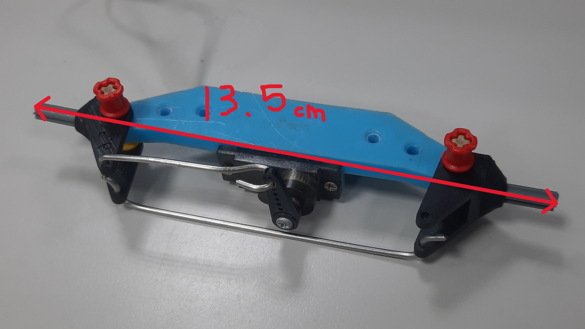</td>
        <td width=60%>
          描述： &emsp;&emsp;
          這版轉向結構過於寬大，因此第二版中我們縮小版型，以提升自駕車的靈活度。
        </td>
      </tr>
      <tr>
        <th colspan=2>第二代轉向結構</th>
      </tr>
      <tr>
        <td>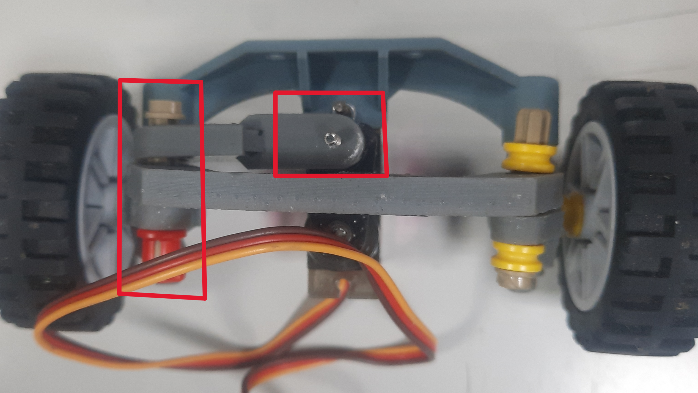</td>
        <td width=400>
          描述： &emsp;&emsp;
          此版本因使用螺絲與樂高零件連接，轉向角度受限，因此下一版將改用圓頭十字軸與圓頭舵盤以增加轉向範圍。
        </td>
      </tr>
      <tr>
        <th colspan=2>第三代轉向結構</th>
      </tr>
      <tr>
        <td>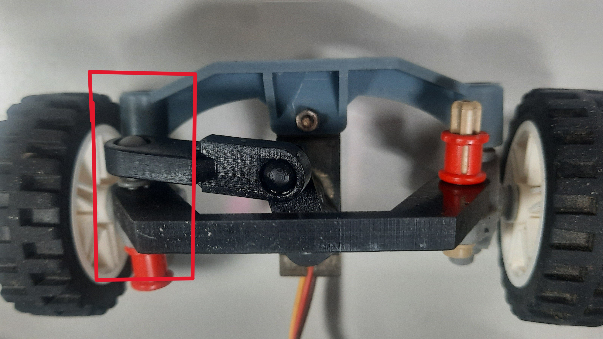</td>
        <td width=400>
          描述： &emsp;&emsp;
          這一版因轉向力矩出現問題，我們重新檢視設計圖。下一版將把轉向拉桿與連桿連接位置調整至與圓頭舵盤平行，並增加轉向極限擋塊，避免角度過大導致結構內凹。
        </td>
      </tr>
      <tr>
        <th colspan=2>第四代轉向結構</th>
      </tr>
      <tr>
        <td>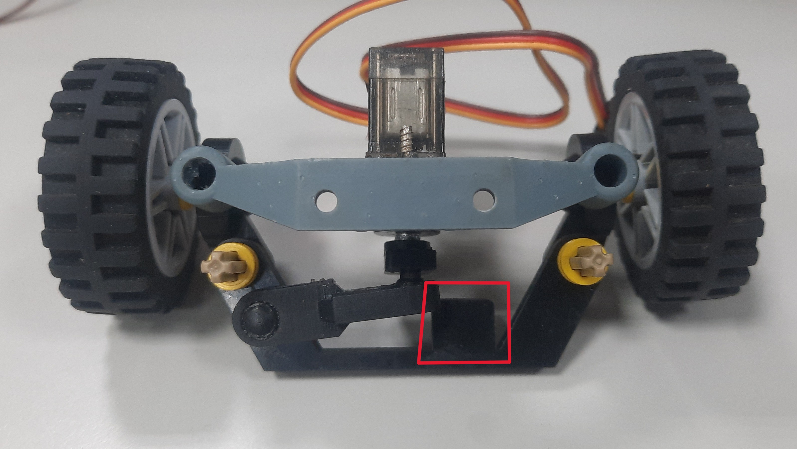</td>
        <td width=400>
          描述： &emsp;&emsp;
          這一版因轉向極限擋塊過大，限制了轉向角度，降低了自駕車靈活性。因此在下一版中，我們會縮短極限擋塊，以兼顧轉向幅度與結構保護。
        </td>
      </tr>
      <tr>
        <th colspan=2>第五代轉向結構</th>
      </tr>
      <tr>
        <td>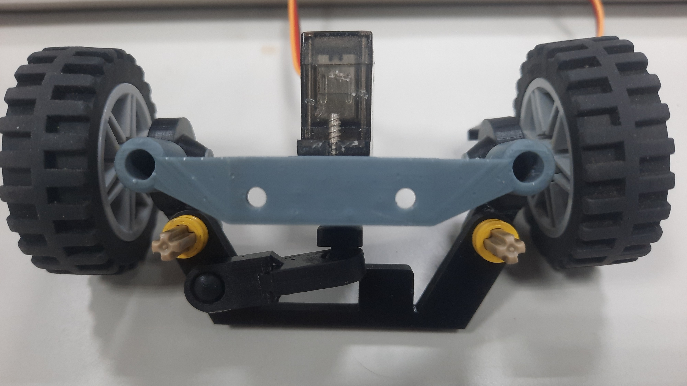</td>
        <td width=400>
          描述： &emsp;&emsp;
          經過前幾代轉向結構的修正與優化，目前的轉向結構已能滿足我們機型的需求。
        </td>
      </tr>
    </table>
  

- ###  Gear Differential

  - The gear differential is a crucial component of a vehicle's drivetrain, used to balance and distribute power to different wheels.
  - It allows the driven wheels to rotate at different speeds, especially during turns. This is crucial for enhancing the vehicle's agility and maneuverability. The gear differential achieves this function through a series of gear mechanisms, enabling the two drive wheels to rotate adaptively, ensuring the stability and balance of the vehicle, and maintaining good driving conditions regardless of road conditions.
   - #### The LEGO Brick Gear Differential Introduction 
        - In this competition, we use a LEGO brick gear differential to achieve the function of the vehicle driving and turning.
        - There are two types of LEGO brick gear differentials: LEGO 6573 Differential Gear and LEGO 62821 Differential Gear.
        - LEGO 62821 Differential Gear: It features a single 28-tooth outer gear combined with four LEGO Gear 12 Tooth Bevel 4565452. The compact enclosed housing design improves durability and torque transmission efficiency. The center structure holds the bevel gears firmly in place, ensuring smooth power distribution to both output axles, making it more efficient and reliable than the older LEGO 6573 Differential Gear.
        - LEGO 6573 Differential Gear: Integrating a 16-tooth gear and a 24-tooth gear, both gears have a 5mm diameter hole in the center for easy placement of a cross axle. There is a small pillar in the center of the differential, allowing us to better secure the right-angle bevel gears and combine three LEGO Gear 12 Tooth Bevel 4565452.

          

          <table>
          <tr align=center>
          <th>LEGO 62821 GearDifferential</th>
          <th>LEGO 6573 Gear Differential</th>
          </tr><tr align=center>
          <td>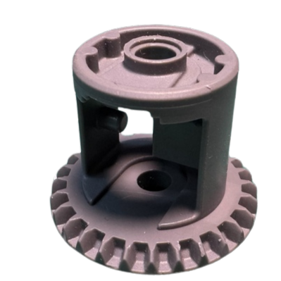</td>
          <td>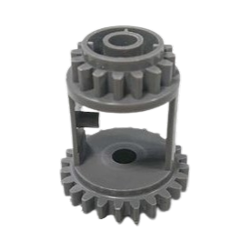</td>
          </tr>
          </table>
          

    - #### Reason for Selection
        - We originally used the LEGO 62821 gear differential as a component of the steering system. However, during the process of reducing the chassis size, we encountered the problem that the differential occupied too much space. Therefore, we switched to the LEGO 6573 gear differential, which successfully solved this issue.

        

        <table>
        <tr>
        <th>LEGO 62821 Gear Differential </th>
        <th>LEGO 6573 Gear Differential </th>
        </tr><tr align=center>
        <td>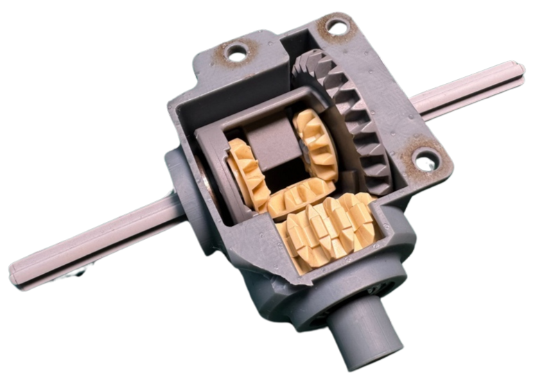</td>
        <td></td>
        </tr>
        </table>
        

### 中文:
- ### Supplementary information-補充資訊
    - #### 什麼是阿克曼轉向幾何？
      __Ackermann轉向幾何介紹__
        - Ackermann轉向幾何由德國汽車工程師Lankensperger於1817年提出，是汽車中使用的一種轉向系統設計。此設計用於解決車輛轉彎時內外側轉向輪行徑的幾何差異問題。
        - Ackermann轉向幾何應用於車輛的轉向機構，透過四連桿系統的相應曲柄，使車輪相對於投影輪胎的轉向角增加約2至4度。這樣可使四個車輪的軌跡中心大致會聚於後軸延長線上，從而實現車輛轉彎。
  ### 英文:
    - #### What is an Ackermann Steering Geometry?
      __Ackermann Steering Geometry Introduction__
        - The Ackermann steering geometry, proposed by German automotive engineer Lankensperger in 1817, is a steering system design used in automobiles. It was developed to address the geometric discrepancy in the paths of the inner and outer turning wheels when a vehicle makes a turn.
        - People apply Ackermann steering geometry to the steering mechanism of vehicles. Through the corresponding cranks of the four-linkage system, the steering angle of the wheels relative to the projected tire is increased by about 2 to 4 degrees. This results in the rough convergence of the trajectory centers of all four wheels along the extension line of the rear axle, thereby achieving the vehicle's turning.
      
        

      Reference Link：[Ackermann steering geometry@Wikipedia](https://zh.wikipedia.org/zh-tw/%E9%98%BF%E5%85%8B%E6%9B%BC%E8%BD%89%E5%90%91%E5%B9%BE%E4%BD%95)
      ### 中文:
      #### Ackermann轉向幾何原理基於以下概念：
      - __轉彎半徑差異：__ 當車輛轉彎時，兩個前輪需以不同角度旋轉，使車輛能繞著一個中心點轉動。
      - __兩個前輪的轉向角度：__ Ackermann轉向幾何的設計確保兩個前輪在轉向時同時通過該中心點。
      - 與使用原始0% LEGO積木製作的Ackermann轉向幾何相比，本次比賽車輛的轉向機構參考了80%的Ackermann轉向幾何設計，帶來阻力降低與轉彎更順暢的優勢。Ackermann轉向幾何零件採用立體光固化（SLA）3D列印製作。然而，製程中最具挑戰性的是調整Ackermann比率，使車輛能夠達到理想的轉向角度，有效繞過障礙物。
      ### 英文:
      #### The principle of Ackermann steering geometry is based on the following concepts:     
       - __Difference in Turning Radius:__ When the vehicle makes a turn, the two front wheels need to rotate at different angles to allow the vehicle to pivot around a central point.
       - __Turning Angles of the Two Front Wheels:__ The design of the Ackermann steering geometry ensures that both front wheels pass through a central point simultaneously during steering.
      - Compared to the Ackermann steering geometry made from the original 0% LEGO bricks, the steering mechanism of this competition vehicle is designed with reference to an 80% Ackermann steering geometry. It offers advantages such as reduced resistance and smoother turns. The Ackermann steering geometry parts are produced using a stereolithography (SLA) 3D printer. However, the most challenging aspect of the process was adjusting the Ackermann ratio to achieve the ideal turning angle for our vehicle to navigate around blocks effectively.  
    ### 中文:  
  - #### 為什麼選擇80%的Ackermann比率？
    - 理論上，這種設計是實現平順且高效轉彎的最佳選擇，但可能導致輪胎過度磨損。因此，在汽車設計中，通常不會選擇100%的Ackermann比率。
    - 與100%的Ackermann比率相比，80%的Ackermann比率能帶來更順暢、更可預測的轉彎，提升操控性並減少輪胎磨損。
  ### 英文:
  - #### Why Choose an 80% Ackermann Ratio?
    - In theory, this design is the optimal choice for smooth and efficient turns. However, it may lead to excessive tire wear. Therefore, in automobile design, a 100% Ackermann ratio is usually not chosen. Compared to a 100% Ackermann ratio, an 80% Ackermann ratio allows for smoother, more predictable turns, improves maneuverability, and reduces tire wear.
  
    - #### Calculating the Ackermann Angle Graphically (a-b = ack)-計算Ackermann轉向角（a - b = ack）示意圖
    

    <table>
    <tr align=center>
    <td width="30%"></td>
    <td width="30%"></td>
    </tr>
    </table>
    

    Reference Video website：[汽车转弯 没那么简单: 阿克曼转向几何是个啥？How does Ackerman steering geometry work?](https://www.youtube.com/watch?v=8AimxDPWKcM)

# 
[Return Home](../../)
  
