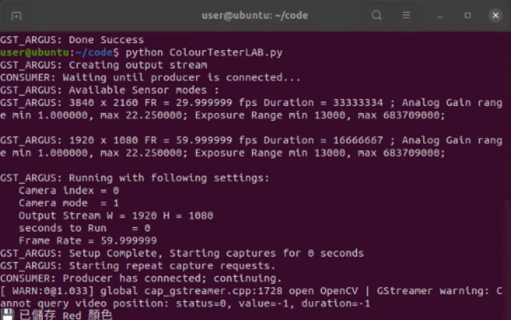
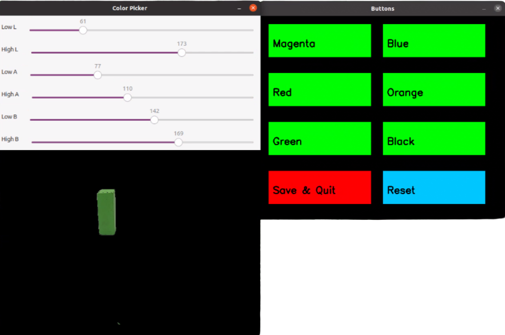
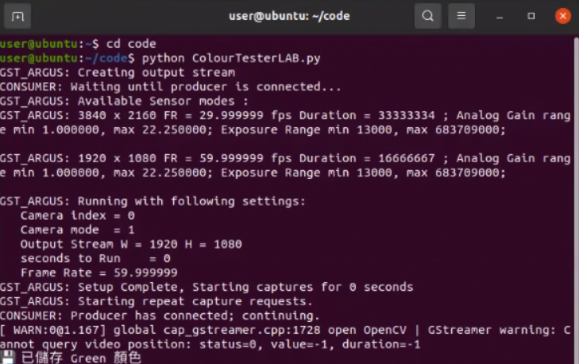
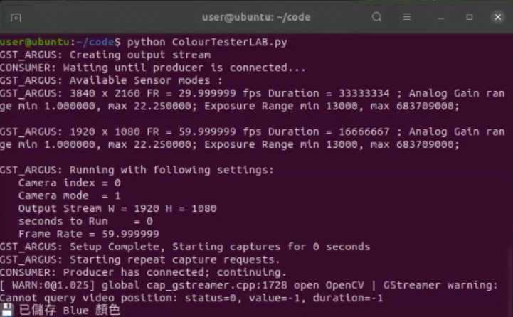
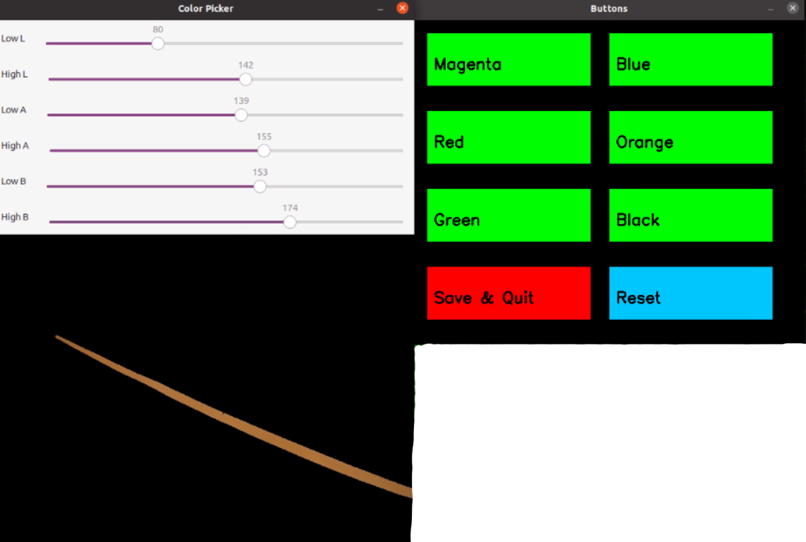
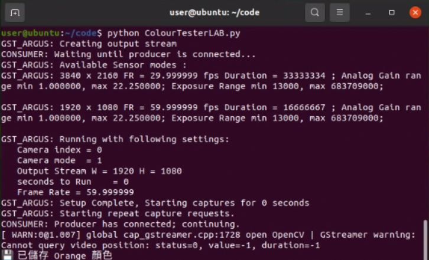
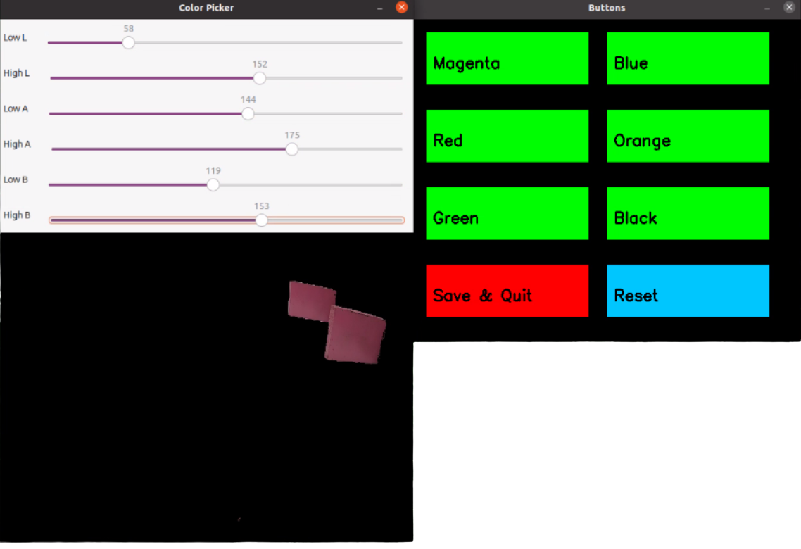
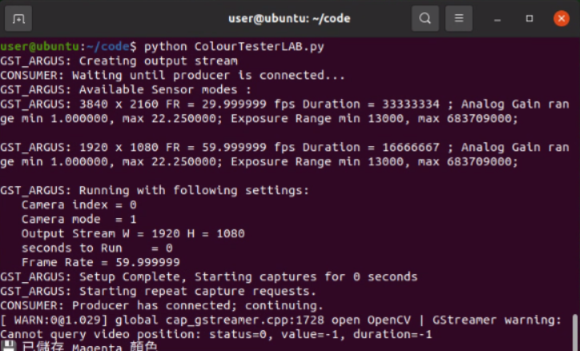

<div align="center"></div>

## <div align="center"> Automatically record the LAB values of the field-自動保存記錄場地的 LAB 值</div>
- 為精確記錄交通標誌積木（紅、綠）、停車區的洋紅色邊牆 1，以及轉彎區的藍、橘線 2，我們開發了一套車輛控制程式 3，它能自動計算並將各物件顏色最終的 $LAB$ 值 4 儲存在 Jetson Orin Nano 控制器中。這項自動化功能省去了手動記錄的繁瑣步驟，不僅節省了時間，更確保了數據的準確性與一致性。

- To accurately record the $LAB$ values for the traffic sign blocks (red and green) 5, the magenta 6side walls of the parking lot 7, and the blue and orange lines 8in the turning areas, we developed a Vehicle's control program9. This program automatically calculates and stores the final $LAB$ values for the color of each object in the Jetson Orin Nano controller. This automation eliminates the tedious step of manual recording, significantly saving time and ensuring the accuracy and consistency of the data.
- #### Image processing-影像處理
    ### 中文:
    - 在影像處理時，使用 Color_LAB.py 檔案將交通標誌方塊與場地底圖上的線條轉換到不同的色彩空間是必須的步驟，以有效處理特定任務。
    - 我們使用 cv2.cvtColor 函數將原始的 RGB 影像轉換成 LAB（明度、紅綠軸、黃藍軸）色彩空間。
    - 轉換完成後，透過 cv2.inRange 函數並設定六個 LAB 閾值：L_low、L_high、A_low、A_high、B_low、B_high 來定義顏色範圍。cv2.inRange 函數會將 LAB 影像中每個像素與設定的範圍做比較，若像素值落在範圍內則保留，否則過濾掉。此過程可得到濾波後的影像。
    - 取得濾波後影像後，我們將對應數值儲存進 masks.py 檔案中進行儲存。
    - 在主程式中我們透過下方代碼呼叫masks檔案中的各物件數值，輸入給相對應的函數進行 LAB 視覺辨識。
        ```python
        from masks import rMagenta, rRed, rGreen, rBlue, rOrange, rBlack
        ```

<div align="center">

**Red traffic sign block-紅色交通標誌方塊**

|Adjusting the LAB Range Values for Red Color(調整紅色的 LAB 範圍值)|Save the LAB range values for Red(儲存紅色的 LAB )|Live image of the Red traffic sign block(紅色交通標誌方塊的即時影像)|
|:----:|:----:|:----:|
||||


**Green traffic sign block-綠色交通標誌方塊**


|Adjusting the LAB Range Values for GreenColor(調整綠色的 LAB 範圍值)|Save the LAB range values for Green(儲存綠色的 LAB )|Live image of the Green traffic sign block(綠色交通標誌方塊的即時影像)|
|:----:|:----:|:----:|
||||


**Blue line-藍色線條**


|Adjusting the LAB Range Values for Blue Color(調整藍色的 LAB 範圍值)|Save the LAB range values for Blue(儲存藍色的 LAB )|Live image of the Blue line（藍色線條的即時影像）|
|:----:|:----:|:----:|
||||


**Orange line-橘色線條**


|Adjusting the LAB Range Values for Orange Color(調整橘色的 LAB 範圍值)|Save the LAB range values for Orange(儲存橘色的 LAB)|Live image of the Orange line(橘色線條的即時影像) |
|:----:|:----:|:----:|
||||


**magenta sidewall-洋紅色測牆**


|Adjusting the LAB Range Values for magenta Color(調整洋紅色的 LAB 範圍值)|Save the LAB range values for Pink(儲存洋紅色的 LAB )|Live image of the Pink sidewall(洋紅色邊牆的即時影像)|
|:----:|:----:|:----:|
||||

</div>


# <div align="center">[Return Home](../../)</div>  
