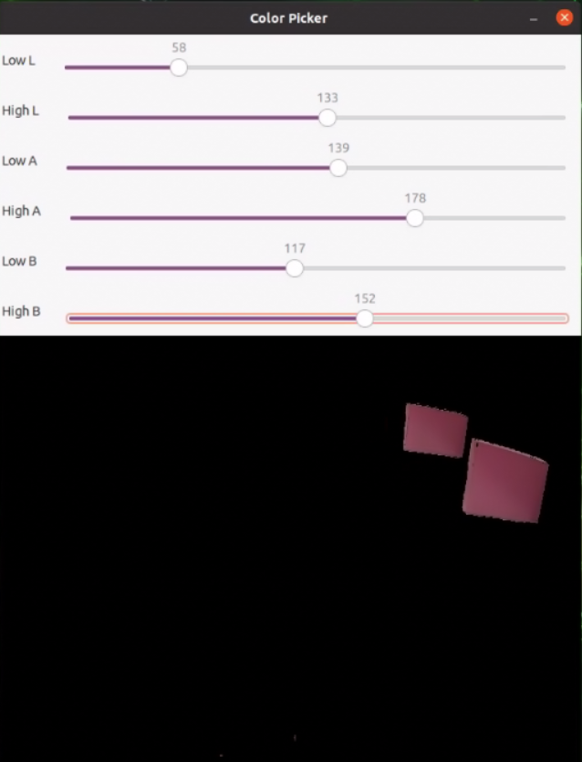
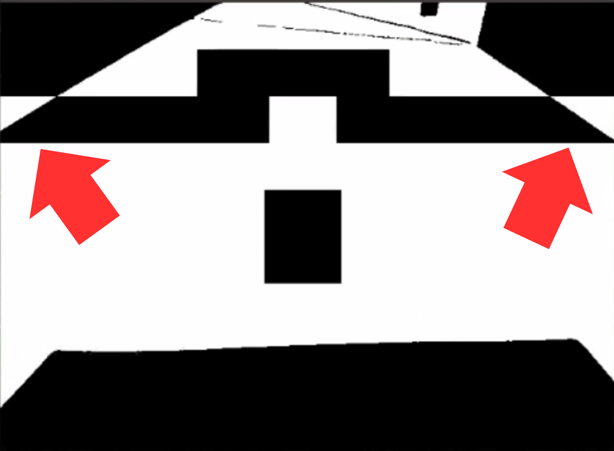
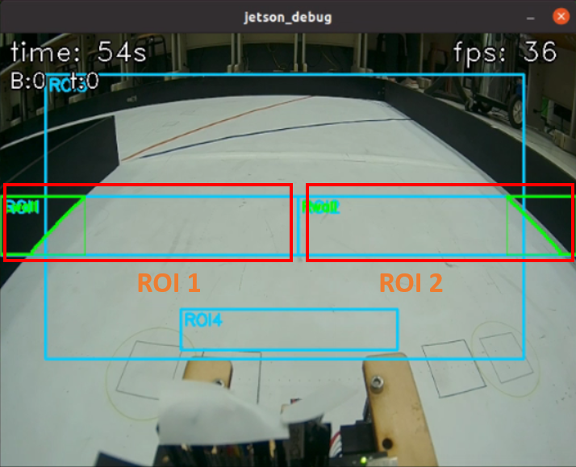

## 
Image Recognition Processing-影像辨識處理
 
### 中文:
  - 比賽場地上有紅、綠、藍、橙、洋紅、黑六種顏色，需要透過影像辨識來確定它們的位置，使車輛能夠順利避開障礙物或完成指定任務。 
  - 我們將使用流行的影像辨識軟體OpenCV來辨識比賽場上的物體。
### 英文:
  - There are six colors on the competition field—red, green, blue, orange, magenta, and black—which must be located via image recognition so the Vehicle can smoothly avoid obstacles or complete the assigned tasks.
  - We will use the popular image recognition software OpenCV to recognize objects on the competition field.
  
### Using LAB for Color Detection in OpenCV - 在OpenCV中使用LAB進行顏色檢測([ColourTesterLAB.py](../Programming/common/ColourLAB.py))
  - 為了進行色彩偵測，我們將 RGB 色彩空間轉換為 LAB，並將 LAB 值分為上下限以建立範圍，確保準確的目標偵測。具體步驟如下：

  - To perform color detection, we convert the RGB color space to LAB and define lower and upper LAB thresholds to establish a range, ensuring accurate target detection. The specific steps are as follows:

### 中文:
  1. **顏色轉換**：
  使用 cv2.cvtColor(image, cv2.COLOR_BGR2LAB) 將 RGB 影像轉換為 LAB 色彩空間。L表示亮度，範圍從0(黑色)到100(白色)，A表示紅和綠色度，A為正時偏紅、為負時偏綠；B表示黃和藍色度，B為正時偏黃、為負時偏藍。LAB 做顏色辨識的關鍵是把亮度L與色彩A和B分離，實作上只需在A和B調整色彩閾值就能穩定過濾出目標色，則L可以因應現場的陰影、反光及曝光來做調整，不會干擾色彩的判斷。
  2. **調整顏色偵測閾值**：
  使用 cv2.getTrackbarPos() 函數取得滑桿的即時數值，通常配合OpenCV的視窗介面使用。滑桿可做動態調整L HIGH、L LOW、A HIGH、A LOW、B HIGH和B LOW的閾值參數，透過即時影像處理調整參數可以更直觀且快速。
  3. **過濾目標顏色**：
  使用 cv2.inRange() 設定顏色範圍的上下界，建立二值遮罩圖像。此函數會將不在範圍內的像素轉為黑色（像素值為 0），過濾雜訊並保留目標顏色區域，以利後續處理與分析。

### 英文:
  1. **Color Conversion**:  
  Use `cv2.cvtColor(image, cv2.COLOR_BGR2LAB)` to convert the RGB image to the LAB color space. L denotes lightness, ranging from 0 (black) to 100 (white); A denotes the red–green component (positive toward red, negative toward green); B denotes the yellow–blue component (positive toward yellow, negative toward blue). The key to using LAB for color recognition is separating lightness L from the chromatic channels A and B. In practice, you only need to tune the color thresholds on A and B to robustly filter the target color, while L can be adjusted to account for shadows, reflections, and exposure on site without interfering with color judgment.
  2. **Adjust Color-detection Thresholds**:  
  Use `cv2.getTrackbarPos()` to read the real-time values from sliders (typically used with OpenCV’s window UI). The sliders can dynamically adjust the threshold parameters L HIGH, L LOW, A HIGH, A LOW, B HIGH, and B LOW. Tuning parameters on live video makes the process more intuitive and faster.
  3. **Filter The Target Color**:  
  Use `cv2.inRange()` to set the lower and upper bounds of the color range and create a binary mask image. Pixels outside the range are set to black (value 0), which suppresses noise and preserves only the regions of the target color for subsequent processing and analysis.

<table>
<tr>
<th>Adjust the LAB range for red(調整紅色的LAB範圍值)</th>
<th>Adjust the LAB range for green(調整綠色的LAB範圍值)</th>
</tr>
<tr>
<td align="center"></td>
<td align="center"></td>
</tr>
<tr>
<th>Adjust the LAB range for blue(調整藍色的 LAB 範圍值)</th>
<th>Adjust the LAB range for orange(調整橙色的 LAB 範圍值)</th>
</tr>
<tr>
<td align="center"></td>
<td align="center"></td>
</tr>
</table>
<table>
<tr>
<th>Adjust the LAB range for magenta(調整洋紅色的 LAB 範圍值)</th>
</tr>
<tr>
<td align="center"></td>
</tr>
</table>

  ### 中文:
    一開始我們採用RGB 影像轉換為灰階影像灰階影像在轉換為二值影像來辨識賽道邊界，但我們研究其他國際賽隊伍的作法後，我們發現加拿大隊伍利用邊緣檢測描繪牆面輪廓，能提供更穩定的偵測。因此，我們決定改成邊緣檢測這種方式，ROI1和ROI2左右兩邊來描繪牆壁輪廓。
  ### 英文:
    1. **Color Conversion**:  
     We start by using `cv2.cvtColor(image, cv2.COLOR_BGR2GRAY)` to convert the RGB image to grayscale, then apply `cv2.threshold(src, thresh, maxval, type)` to transform the grayscale image into a binary image.
    2. **Adjusting Color Range**: 
     To ensure a clear black-and-white boundary between the floor and the sidewalls, we use `cv2.getTrackbarPos()` to dynamically adjust the threshold until the desired boundary effect is achieved.

<table>
<tr>
<th> 二值化牆壁檢測</th>
<th> ROI邊緣檢測</th>
</tr>
<tr>
     <td></td>
     <td></td>
     </tr>
     </table>
     

<table>
<tr>
<th> Obstacle Detection on in Images　(影像中的障礙物檢測)</th>
<th> Orange and Blue lines Detection on in Images（影像中的橙色和藍色線條檢測）</th>
<th> floor-to-boundary (black-and-white) Detection on in Images（影像中的地板到邊界邊緣檢測）</th>
</tr>
<tr>
<td></td>
<td></td>
<td></td>
</tr>
</table>

# 
[Return Home](../../)
  
