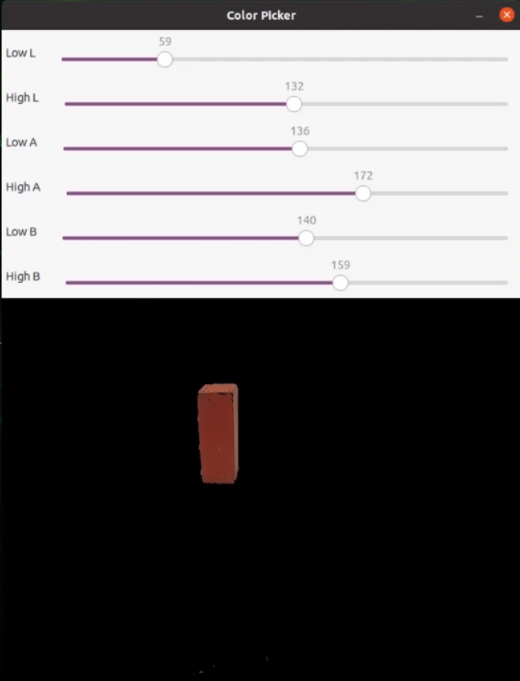
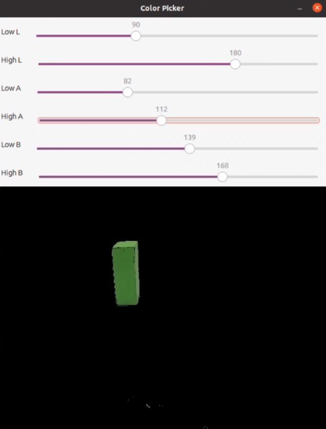
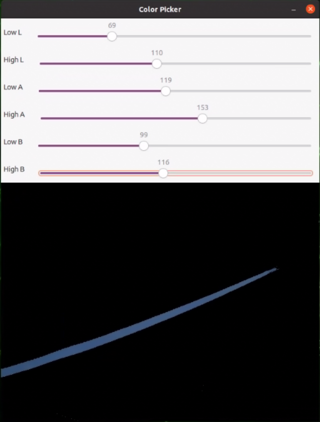
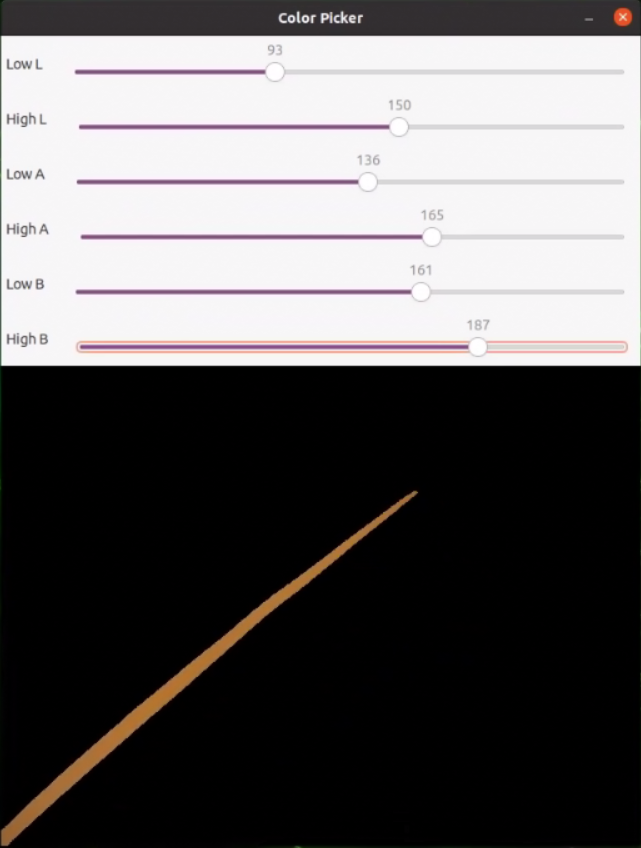
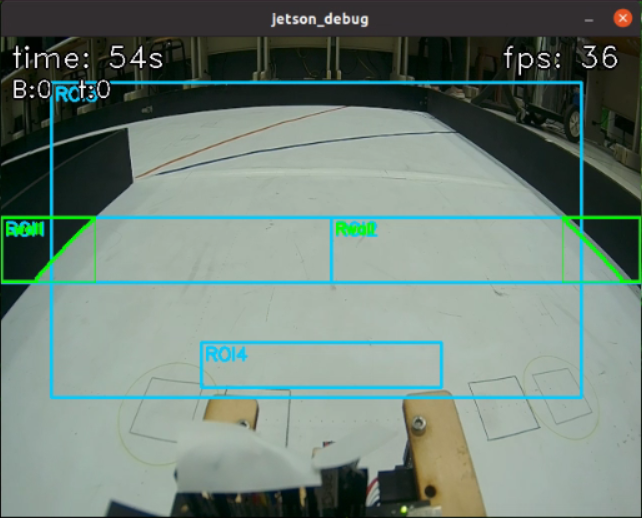
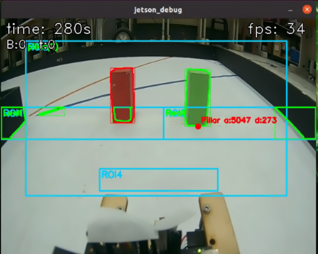
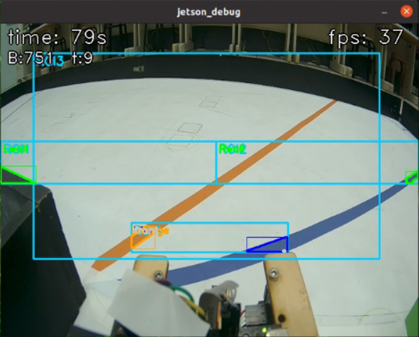
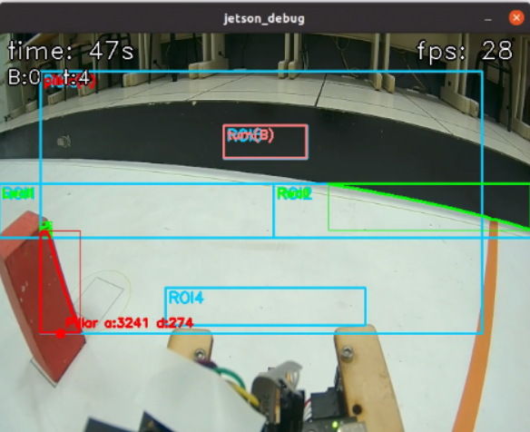

## 
Image Recognition Processing-影像辨識處理
 
### 中文:
  - 比賽場地上有紅、綠、藍、橙、洋紅色、黑六種顏色，需要透過影像辨識來確定它們的位置，使車輛能夠順利避開障礙物或完成指定任務。 
  - 我們將使用流行的影像辨識軟體OpenCV來辨識比賽場上的物體。
  ### 英文:
  - On the competition field, there are six colors—red, green, blue, orange, pink, and black—that need to be identified through image recognition to determine their locations, enabling the vehicle to successfully avoid obstacles or complete designated tasks.
  - We will use the popular image recognition software OpenCV to identify objects on the competition field.
  
- #### Color Detection Using LAB in OpenCV-在 OpenCV 中使用 LAB 進行顏色檢測([ColourTesterLAB.py](../Programming/common/ColourTesterLAB.py.py))
  - 為了進行色彩偵測，我們將 RGB 色彩空間轉換為 LAB，並將 LAB 值分為上下限以建立範圍，確保準確的目標偵測。具體步驟如下：

  - To perform color detection, we convert the RGB color space to LAB and split the LAB values into upper and lower bounds to establish a range, ensuring accurate target detection. The detailed steps are as follows:
  ### 中文:
    1. **顏色轉換：**:
    使用 cv2.cvtColor(image, cv2.COLOR_BGR2LAB) 將 RGB 影像轉換為 LAB 色彩空間。LAB 色彩空間提供更直觀的顏色範圍控制，方便過濾特定顏色。
    2. **調整顏色範圍**：
    使用 cv2.getTrackbarPos() 函數取得滑桿的即時數值，通常配合 OpenCV 的視窗介面使用。在即時影像處理中，透過滑桿可動態調整參數，如門檻值或顏色範圍，方便測試與微調。
    3. **過濾目標顏色**：
    使用 cv2.inRange() 設定顏色範圍的上下界，建立二值遮罩圖像。此函數會將不在範圍內的像素轉為黑色（像素值為 0），過濾雜訊並保留目標顏色區域，以利後續處理與分析。
    ### 英文:
    1. **Color Conversion**:  
    Use `cv2.cvtColor(image, cv2.COLOR_BGR2LAB)` to convert the RGB image to LAB color space. The LAB space allows for more intuitive control over color range, making it easier to filter specific colors.
    2. **Adjusting Color Range**:  
    Use the function `cv2.getTrackbarPos()` to get the current value from the trackbar, which is typically used with an OpenCV display window. In real-time image processing, trackbars allow dynamic adjustment of parameters, such as the threshold or color range, making testing and fine-tuning convenient.
    3. **Filtering Target Color**:  
    Use `cv2.inRange()` to set the upper and lower bounds for the color range and create a binary mask image. This function converts out-of-range colors to black (pixel value 0), filtering out noise and retaining only the target color areas, facilitating further processing and analysis.
    

    <table>
    <tr>
    <th>Adjusting the LAB Range Values for Red Color(調整紅色的 LAB 範圍值)</th>
    <th>Adjusting the LAB Range Values for Green Color(調整綠色的 LAB 範圍值)</th>
    </tr>
    <tr>
    <td></td>
    <td></td>
    </tr>
    <tr>
    <th>Adjusting the LAB Range Values for Bule Color(調整藍色的 LAB 範圍值)</th>
    <th>Adjusting the LAB Range Values for Orange Color(調整橙色的 LAB 範圍值)</th>
    </tr>
    <tr>
    <td></td>
    <td></td>
    </tr>
    </table>
    <table>
    <tr>
    <th>Adjusting the LAB Range Values for Pink Color(調整洋紅色的 LAB 範圍值)</th>
    </tr>
    <tr>
    <td></td>
    </tr>
    </table>
    

  ### 中文:
    一開始我們採用二值化黑白檢測來辨識賽道邊界，但我們研究國際隊伍的作法後，發現加拿大隊利用邊緣檢測描繪牆面輪廓，能提供更穩定的偵測。因此，我們決定改成邊緣檢測這種方式，來描繪牆壁輪廓。
  ### 英文:
    1. **Color Conversion**:  
     We start by using `cv2.cvtColor(image, cv2.COLOR_BGR2GRAY)` to convert the RGB image to grayscale, then apply `cv2.threshold(src, thresh, maxval, type)` to transform the grayscale image into a binary image.
    2. **Adjusting Color Range**: 
     To ensure a clear black-and-white boundary between the floor and the sidewalls, we use `cv2.getTrackbarPos()` to dynamically adjust the threshold until the desired boundary effect is achieved.

     

     <table>
     <tr>
     <th>    </th>
     </tr>
     <tr>
     <td></td>
     </tr>
     </table>
     

<table>
<tr>
<th> Obstacle Detection on in Images　(影像中的障礙物檢測)</th>
<th> Orange and Blue lines Detection on in Images（影像中的橙色和藍色線條檢測）</th>
<th> floor-to-boundary (black-and-white) Detection on in Images（影像中的地板到邊界邊緣檢測）</th>
</tr>
<tr>
<td></td>
<td></td>
<td></td>
</tr>
</table>

# 
[Return Home](../../)
  
