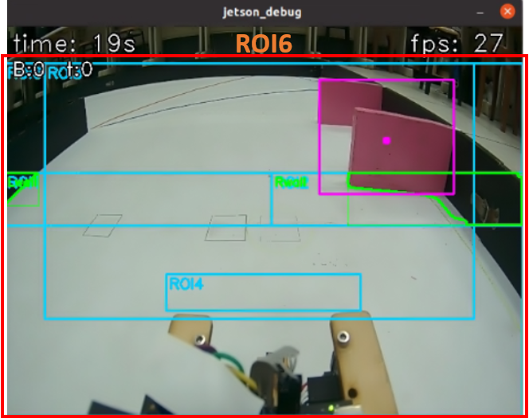

## 
Image Recognition Processing-影像辨識處理
 
### 中文:
  - 比賽場地上有紅、綠、藍、橙、洋紅、黑六種顏色，需要透過影像辨識來確定它們的位置，使車輛能夠順利避開障礙物或完成指定任務。 
  - 我們將使用流行的影像辨識軟體OpenCV來辨識比賽場上的物體。
### 英文:
  - There are six colors on the competition field—red, green, blue, orange, magenta, and black—which must be located via image recognition so the Vehicle can smoothly avoid obstacles or complete the assigned tasks.
  - We will use the popular image recognition software OpenCV to recognize objects on the competition field.
  
### Using LAB for Color Detection in OpenCV - 在OpenCV中使用LAB進行顏色檢測([Color_LAB.py](../Programming/common/Color_LAB.py))
  - 為了進行色彩偵測，我們將 RGB 色彩空間轉換為 LAB，並將 LAB 值分為上下限以建立範圍，確保準確的目標偵測。具體步驟如下：

  - To perform color detection, we convert the RGB color space to LAB and define lower and upper LAB thresholds to establish a range, ensuring accurate target detection. The specific steps are as follows:

### 中文:
  1. **顏色轉換**：
  - 使用 cv2.cvtColor(image, cv2.COLOR_BGR2LAB) 將 RGB 影像轉換為 LAB 色彩空間。L表示亮度，範圍從0(黑色)到100(白色)，A表示紅和綠色度，A為正時偏紅、為負時偏綠；B表示黃和藍色度，B為正時偏黃、為負時偏藍。LAB 做顏色辨識的關鍵是把亮度L與色彩A和B分離，實作上只需在A和B調整色彩閾值就能穩定過濾出目標色，則L可以因應現場的陰影、反光及曝光來做調整，不會干擾色彩的判斷。
  2. **調整顏色偵測閾值**：
  - 使用 cv2.getTrackbarPos() 函數取得滑桿的即時數值，通常配合OpenCV的視窗介面使用。滑桿可做動態調整L HIGH、L LOW、A HIGH、A LOW、B HIGH和B LOW的閾值參數，透過即時影像處理調整參數可以更直觀且快速。
  3. **過濾目標顏色**：
  - 使用 cv2.inRange() 設定顏色範圍的上下界，建立二值遮罩圖像。此函數會將不在範圍內的像素轉為黑色（像素值為 0），過濾雜訊並保留目標顏色區域，以利後續處理與分析。

### 英文:
  1. **Color Conversion**:  
  - Use `cv2.cvtColor(image, cv2.COLOR_BGR2LAB)` to convert the RGB image to the LAB color space. L denotes lightness, ranging from 0 (black) to 100 (white); A denotes the red–green component (positive toward red, negative toward green); B denotes the yellow–blue component (positive toward yellow, negative toward blue). The key to using LAB for color recognition is separating lightness L from the chromatic channels A and B. In practice, you only need to tune the color thresholds on A and B to robustly filter the target color, while L can be adjusted to account for shadows, reflections, and exposure on site without interfering with color judgment.
  2. **Adjust Color-detection Thresholds**:  
  - Use `cv2.getTrackbarPos()` to read the real-time values from sliders (typically used with OpenCV’s window UI). The sliders can dynamically adjust the threshold parameters L HIGH, L LOW, A HIGH, A LOW, B HIGH, and B LOW. Tuning parameters on live video makes the process more intuitive and faster.
  3. **Filter The Target Color**:  
  - Use `cv2.inRange()` to set the lower and upper bounds of the color range and create a binary mask image. Pixels outside the range are set to black (value 0), which suppresses noise and preserves only the regions of the target color for subsequent processing and analysis.

<table>
<tr>
<th>Adjust the LAB range for red(調整紅色的LAB範圍值)</th>
<th>Adjust the LAB range for green(調整綠色的LAB範圍值)</th>
</tr>
<tr>
<td align="center"></td>
<td align="center"></td>
</tr>
<tr>
<th>Adjust the LAB range for blue(調整藍色的 LAB 範圍值)</th>
<th>Adjust the LAB range for orange(調整橙色的 LAB 範圍值)</th>
</tr>
<tr>
<td align="center"></td>
<td align="center"></td>
</tr>
</table>
<table>
<tr>
<th>Adjust the LAB range for magenta(調整洋紅色的 LAB 範圍值)</th>
</tr>
<tr>
<td align="center"></td>
</tr>
</table>

### Using Edge Detection in OpenCV to trace the contours of the interior walls, exterior walls, red pillar, green pillar, orange lines, blue lines, and magenta walls, and to detect them with ROI (regions of interest) - 在OpenCV中使用邊緣檢測來描繪內牆、外牆、紅柱、綠柱、橘線、藍線和洋紅牆面輪廓，並用ROI影像感興趣區域來偵測
  - 在國內選拔賽之前，我們採用RGB影像轉換為灰階影像，灰階影像再轉換為二值化影像來辨識賽道牆面。國內選拔賽之後，我們研究其他國際賽隊伍辨識牆面和物件的作法，發現加拿大隊伍利用邊緣檢測描繪內牆、外牆、紅柱、綠柱、橘線、藍線和洋紅牆面輪廓，能提供更穩定的偵測。因此，我們決定改成邊緣檢測這種方式，建立ROI1~ROI6影像感興趣區域，將要偵測的物件透過對應的ROI影像感興趣區域描繪出輪廓並轉為X和Y座標及面積。具體步驟如下：
  - Before the national selection rounds, we converted RGB images to grayscale and then to binary images to recognize the track walls. After the national selection rounds, we studied how other international teams recognized walls and objects and found that the Canadian team used edge detection to trace the contours of the interior walls, exterior walls, red pillar, green pillar, orange lines, blue lines, and magenta walls, which provided more stable detection. Therefore, we switched to an edge-detection approach: we define regions of interest (ROI1–ROI6), and for each target object we trace its contours within the corresponding ROI and convert them into X and Y coordinates and area. The specific steps are as follows:

### 中文:
  1. **ROI影像感興趣區域建立**：
  - 使用 cv2.boundingRect() 會對一組點求出水平最小外接矩形，回傳整數座標與尺寸 (x, y, w, h)，常用來畫框或裁切 ROI。
  - 使用 cv2.rectangle(img, (x, y), (x + w, y + h), color, 1) 會在影像 img 上畫出一個矩形：(x, y) 是左上角座標、(x + w, y + h) 是右下角座標，color 是顏色（BGR 三元組，如 (255,204,0) 表示藍綠色），最後的 1 是線條粗細（像素），表示以 1px 邊框描出矩形。
  2. **繪製牆面、物件和線條輪廓**：
  - 使用 cv2.drawContours(img, contours, -1, color, thickness) 會在影像 img 上把輪廓畫出來，contours 是由 findContours 取得的輪廓列表，-1 代表對該列表中的所有輪廓都繪製，color 為 BGR 顏色，thickness 是線寬。
  3. **ROI1和ROI2影像感興趣區域介紹**：
  - 在CSI鏡頭讀取到的畫面上建立ROI1和ROI2影像感興趣區域，使用ROI1偵測左牆則ROI2偵測右牆，繪製出牆面輪廓並轉為面積值，供Jetson Orin Nano運算。
  4. **ROI3影像感興趣區域介紹**：
  - 在CSI鏡頭讀取到的畫面上建立ROI3影像感興趣區域，使用ROI3偵測直線區域的紅柱和綠柱，繪製出柱體輪廓並轉為X、Y座標和面積值，輸入給Jetson Orin Nano運算。
  5. **ROI4影像感興趣區域介紹**：
  - 在CSI鏡頭讀取到的畫面上建立ROI4影像感興趣區域，使用ROI4偵測轉彎區域的藍線和橘線，繪製出線條輪廓並轉為面積值，輸入給Jetson Orin Nano運算。
  6. **ROI5影像感興趣區域介紹**：
  - 在CSI鏡頭讀取到的畫面上建立ROI5影像感興趣區域，當自駕車在彎道區域ROI5偵測到牆面時，繪製出牆面輪廓並轉為面積值，輸入給Jetson Orin Nano運算。
  7. **ROI6影像感興趣區域介紹**：
  - 在CSI鏡頭讀取到的畫面上建立ROI6影像感興趣區域，當自駕車進行停車時ROI6偵測直線區域的洋紅牆面，繪製出牆面輪廓並轉為X、Y座標和面積值，輸入給Jetson Orin Nano運算。
### 英文:
  1. **Establish ROIs (regions of interest)**:  
  - Use `cv2.boundingRect()` to compute the axis-aligned minimum bounding rectangle for a set of points. It returns integer coordinates and size `(x, y, w, h)` and is commonly used to draw boxes or crop an ROI.
  - Use `cv2.rectangle(img, (x, y), (x + w, y + h), color, 1)` to draw a rectangle on `img`: `(x, y)` is the top-left corner, `(x + w, y + h)` is the bottom-right corner, `color` is a BGR triplet (e.g., `(255, 204, 0)` is cyan/blue-green), and the final `1` is the line thickness in pixels.
  2. **Draw contours for walls, objects, and lines**: 
  - Use `cv2.drawContours(img, contours, -1, color, thickness)` to render contours on `img`. `contours` is the list returned by `findContours`; `-1` means draw all contours in the list; `color` is BGR; `thickness` is the line width.
  3. **ROI1 and ROI2 overview**: 
  - On the CSI camera feed, define ROI1 and ROI2. Use ROI1 to detect the left wall and ROI2 to detect the right wall, trace the wall contours, and convert them to area values for computation on the Jetson Orin Nano.
  4. **ROI3 overview**: 
  - On the CSI camera feed, define ROI3. Use ROI3 to detect the red pillar and green pillar in straight segments, trace the pillar contours, and convert them to X/Y coordinates and area values as inputs to the Jetson Orin Nano.
  5. **ROI4 overview**: 
  - On the CSI camera feed, define ROI4. Use ROI4 to detect blue lines and orange lines in turning segments, trace the line contours, and convert them to area values as inputs to the Jetson Orin Nano.
  6. **ROI5 overview**: 
  - On the CSI camera feed, define ROI5. When the Self-Driving-Cars vehicle is in a cornering segment and ROI5 detects a wall, trace the wall contours and convert them to area values as inputs to the Jetson Orin Nano.
  7. **ROI6 overview**: 
  - On the CSI camera feed, define ROI6. During parking, use ROI6 to detect magenta walls in straight segments, trace the wall contours, and convert them to X/Y coordinates and area values as inputs to the Jetson Orin Nano.

  <!-- 上排（三欄） -->
  <table>
    <tr>
      <th width=300>Binarized wall detection(二值化檢測牆面)</th>
      <th width=300>ROI1 and ROI2: detect walls(ROI1和ROI2檢測牆面)</th>
      <th width=300>ROI3: detect the red pillar and green pillar(ROI3檢測紅與綠柱)</th>
    </tr>
    <tr>
      <td align="center">
        
      </td>
      <td align="center">
        
      </td>
      <td align="center">
        
      </td>
    </tr>
  </table>

  <!-- 下排（三欄） -->
  <table>
    <tr>
      <th>ROI4: detect orange lines and blue lines(ROI4檢測橘與藍線)</th>
      <th>ROI5: assist in detecting the front wall(ROI5輔助檢測前方牆面)</th>
      <th>ROI6: detect magenta walls(ROI6檢測洋紅牆面)</th>
    </tr>
    <tr>
      <td align="center">
        
      </td>
      <td align="center">
        
      </td>
      <td align="center">
        
      </td>
    </tr>
  </table>

# 
[Return Home](../../)
  
