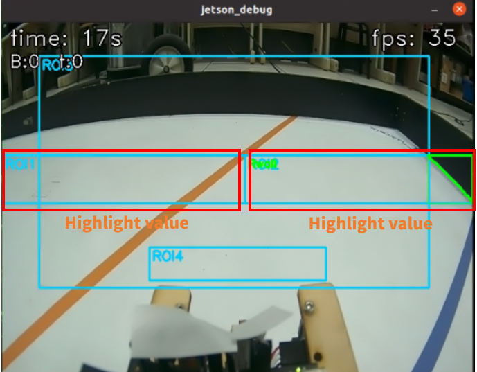
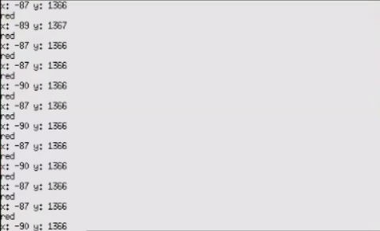

<div align=center>  </div>

## <div align="center">Overview of Parking Lot Departure Steering Control-停車場出發轉向控制概述</div> 

 - ### Vehicle steering control-車輛轉向控制
    ### 中文:
    - 一開始我們我先判斷順時針還是逆時針的行駛方向，然後再朝向柱子判斷是紅色還是綠色
   ### 英文:
    - When the vehicle detects a blue or orange line on the ground, the system triggers a steering action. Highlighted value detection of the sidewall ensures the vehicle maintains a safe distance to avoid collisions, while the blue and orange line detection identifies the vehicle’s turning direction, allowing it to navigate curves or corners safely and precisely.
    - As the vehicle moves, the system uses the camera to detect highlighted values and the blue and orange lines on the ground. When approaching a turn, the system assesses the y-axis position of the blue and orange lines and uses these values to determine the proximity of the turn. The closer the distance, the larger the y-axis value. The system selects the color with the largest y-axis value as the basis for steering direction, ensuring accurate turning.
    - After determining the turning direction, the system further evaluates the highlighted values on the left and right sides of the camera view. The turn action only initiates when the highlighted value reaches or exceeds 4500. This setup effectively prevents premature turning, reducing the risk of the vehicle hitting the sidewall due to early steering, and ensures accuracy and safety in turning.
        - program code:
  ```
   if count == 0:
       if cPillar.area == 0:
           aDiff = leftArea-rightArea
           angle = int(aDiff*kp + (aDiff - prevDiff)*kd)
        angle = clamp(angle, sharpLeft, sharpRight)
        prevDiff = aDiff
    else:
        error = cPillar.x - cPillar.target
        angle = int(0 + error*cKp + (error - prevError)*cKd)
        angle = clamp(angle, sharpLeft, sharpRight)
        if cPillar.target == greenTarget and cPillar.x > 320 and cPillar.area > 1000:
            lastTarget = greenTarget
        elif cPillar.target == redTarget and cPillar.x < 320 and cPillar.area > 1000:
            lastTarget = redTarget
        prevError = error
    frame_id += 1
    if frame_id % log_every == 0:
        print(t, lTurn, rTurn, leftArea, rightArea, cPillar.target, angle, f"{relative_heading:.2f}",
              "mag6:", mag6_area, mag6_center)
 ```
<div align=center>

  |Sidewall highlighted value detection(側壁突出值檢測)
  |Field blue and orange line recognition(場地藍橙線識別)|
  |:---:|:---:|
  |<div align="center"> </div>|<div align="center"> </div>|

</div> 

- ### Vehicle block avoidance control-車輛避障控制
   ### 中文:
  - 根據任務需求，當車輛偵測到紅色交通號誌遮擋時，系統觸發向右繞行機動；當遇到綠色障礙物時，它會觸發向左繞行機動。 
  - 當車輛移動時，攝影機將視訊傳送到控制器（Jetson orin Nano），然後控制器進行影像處理以目標柱子在畫面中的理想 X 座標位置。這些數據可協助控制器確定物體的位置和距離，從而實現精確導航和避障。 
 ### 英文:
  - According to task requirements, when the vehicle detects a red traffic signal block, the system triggers a rightward bypass maneuver; when it encounters a green block, it triggers a leftward bypass maneuver.
  - As the vehicle moves, the camera transmits video to the controller (Jetson Nano), which then performs image processing to obtain the X and Y coordinates and the area size of objects in the frame. This data helps the controller determine the position and distance of objects for accurate navigation and obstacle avoidance.
  - Quadratic Bézier curves in red and green are drawn on the captured image to guide the vehicle toward the traffic signal and accurately position the block along the curve.
  
  - The vehicle completes the traffic signal block avoidance through the following steps:
    
    1. The system detects traffic signal blocks through the camera and uses image recognition to analyze the y-coordinate, area, and color of the blocks, thereby determining the position of the block closest to the vehicle.
    2. Next, the system obtains the X-coordinate of the nearest block and compares it with the corresponding X-coordinate on the Bézier curve to calculate the X-axis deviation. The deviation is then multiplied by a preset avoidance coefficient to determine the final error value.
    3. Finally, based on the calculated error value, the servo motor's turning direction is adjusted to steer the vehicle appropriately, effectively avoiding the block and ensuring the safety and stability of its driving path.
    
<div align=center>

  |Recognize the color of traffic signal blocks.|The color and X, Y coordinates of traffic signal blocks.|
  |:---:|:---:|
  |<div align="center"> </div>|<div align="center"> </div>|

# <div align="center">[Return Home](../../)</div>  


