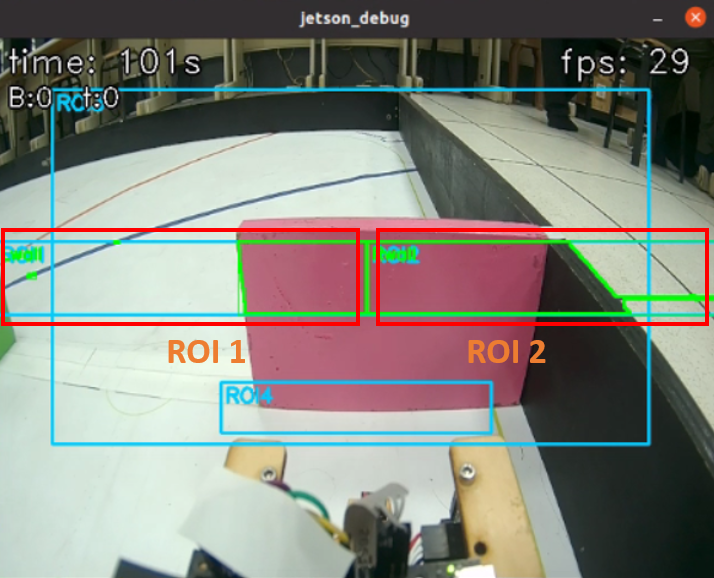
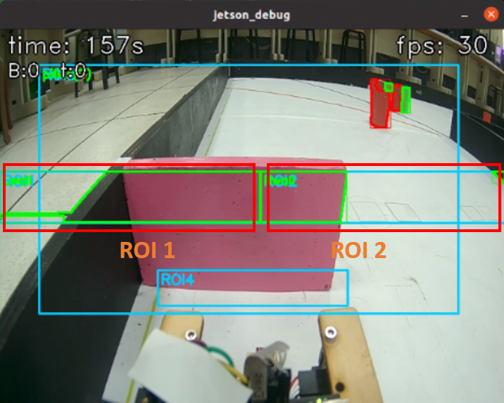
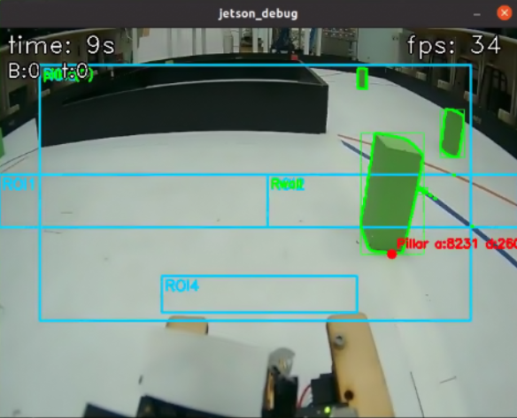
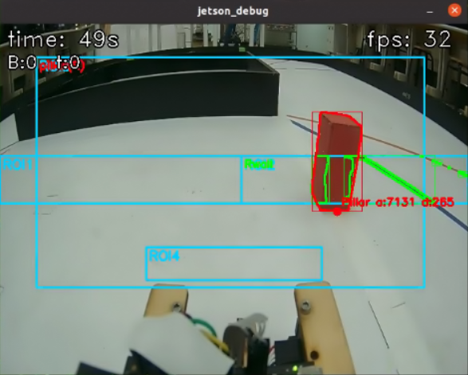
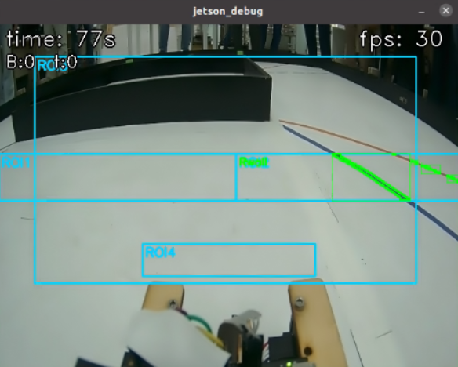
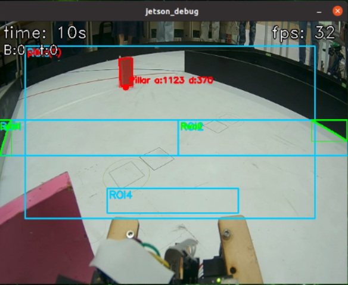
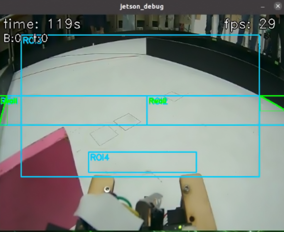

<div align=center>  </div>

## <div align="center">Overview of Parking Lot Departure Steering Control-停車場出發轉向控制概述</div> 

- ### Determination of the Driving direction - 行車方向的判斷
    - 在車輛從停車區啟動之前，它會利用 CSI 鏡頭擷取的畫面，並結合感興趣區域 (ROI) 來預判行車方向。此判斷邏輯是透過比較 ROI_1 和 ROI_2 的面積：若 ROI_1 面積大於 ROI_2 面積，則判定本次行車方向為順時針方向；反之，若 ROI_2 面積大於 ROI_1 面積，則判定為逆時針方向。一旦行車方向確定，車輛隨即駛出停車區，之後系統會立即偵測車道上是否存在交通標誌積木 (即紅 、綠 99色交通標誌)，並根據偵測到的顏色執行相應的變道 (Lane Change) 決策。

    - Before the Vehicle departs from the parking lot, it utilizes the image captured by the CSI camera and applies the Region of Interest (ROI) technique to pre-determine the Driving direction. The determination logic is based on comparing the areas of `ROI_1` and `ROI_2`: if the area of `ROI_1` is greater than the area of `ROI_2`, the current Driving direction is determined to be the clockwise direction ; conversely, if the area of `ROI_2` is greater than the area of `ROI_1`, it is determined to be the Counterclockwise direction. Once the Driving direction is confirmed, the Vehicle exits the parking lot , and the system subsequently detects the presence of traffic signs blocks (red or green traffic signs) in the lane and executes the corresponding Lane Change decision based on the detected color.

  1. **ROI 面積讀取與牆面偵測**:
    - 我們使用 $pOverlap(img_{lab}, ROI_1)$ 和 $pOverlap(img_{lab}, ROI_2)$ 兩個函數，從 $LAB$ 色彩空間影像 $img_{lab}$ 中偵測出位於左右兩側 $ROI$ 區域內的黑色區域。$pOverlap()$ 函數會進一步判斷這些黑色區域是否與品紅色標記發生重疊。此步驟的主要目的在於辨識畫面左右兩側可能出現的牆面或立柱位置，從而為後續的輪廓擷取、面積分析以及路徑判斷提供堅實的基礎依據。
  2. **ROI 輪廓的最大面積擷取**:
    - 在左右兩側的 $ROI$ 區域中，我們使用 $max\_contour(contours_{left}, ROI_1)[0]$ 和 $max\_contour(contours_{right}, ROI_2)[0]$ 兩個函數。透過 $max\_contour()$ 函式，系統能夠分別從左右兩側偵測到的輪廓中，篩選出面積最大的黑牆輪廓區域，並取得其對應的面積值與中心點資訊。

  1. **ROI Area Reading and Wall Detection**:
    - We utilize the functions `pOverlap(img_{lab}, ROI_1)` and `pOverlap(img_{lab}, ROI_2)` to detect black regions within the left and right `ROI` areas, using the `LAB` color space image `img_{lab}`. The `pOverlap()` function further determines whether these black regions overlap with the magenta markings. The primary goal of this step is to identify the positions of walls or pillars that may appear on the left and right sides of the image, thereby providing a solid basis for subsequent contour extraction, area analysis, and path determination. 

  2. **ROI Maximum Contour Area Extraction**:
    - In the left and right `ROI` areas, we utilize the two functions `max\_contour(contours_{left}, ROI_1)[0]` and `max\_contour(contours_{right}, ROI_2)[0]`. Through the `max\_contour()` function, the system can filter out the contour area of the largest black wall from the contours detected on both sides, and retrieve its corresponding area value and center point information. 
    
- program code:
```
        a = 0
        start_turn = 0
        while a == 0:
            rightArea = leftArea = areaFront = tArea = 0
            ok, img = cap.read()
            if not ok:
                continue
            img_lab = cv2.cvtColor(img, cv2.COLOR_BGR2Lab)
            img_lab = cv2.GaussianBlur(img_lab, (3,3), 0)

            contours_left  = pOverlap(img_lab, ROI1)
            contours_right = pOverlap(img_lab, ROI2)
            leftArea  = max_contour(contours_left,  ROI1)[0]
            rightArea = max_contour(contours_right, ROI2)[0]

            if leftArea - rightArea > 0:
                print("右轉"); start_turn = 1; a = 1
            else:
                print("左轉"); start_turn = 2; a = 1

        write(start_turn)     
```
<div align=center>

  |Counterclockwise_direction(逆時針方向)|clockwise(順時針方向)|
  |:---:|:---:|
  |<div align="center"> </div>|<div align="center"> </div>|

</div> 

- ### 判斷顏色行駛路線
  ### 中文:
    - 若為逆時針方向，偵測到綠色柱子則行駛於內側，偵測到紅色柱子則行駛於外側，若未偵測到柱子，則預設行駛外側。
    - 若為順時針方向，偵測到綠色柱子則行駛於外側，偵測到紅色柱子則行駛於內側，若未偵測到顏色，則同樣行駛外側。

  1. **顏色輪廓偵測**:
    - 我們使用find_contours(img_lab, rRed,ROI3)和
    find_contours(img_lab, rGreen, ROI3)，這兩行使用 `find_contours()` 函式，在指定的區域 ROI3 內，從 LAB 色彩空間影像 img_lab 中分別偵測出**紅色區域（rRed）與綠色區
   （rGreen）**的所有輪廓（contours）。結果會是一組包含多個封閉區域的輪廓列表。
  2. **找出最佳立柱**:
    - 我們使用find_best_pillar(contours_red,redTarget,"red",img_lab)和find_best_pillar(contours_green, greenTarget, "green", img_lab)，這兩行使用
    `find_best_pillar()`函式會根據每個輪廓的大小、位置與距離目標點（redTarget / greenTarget）的遠近等條件進行評估。
    回傳的 best_red 與 best_green 各自顏色中評分最高、最接近可通過路線的立柱。若沒有找到符合條件的立柱，則可能回傳 None。


- program code:
    ```
        color = 0
        detect_start = time.time()
        TIMEOUT = 2.0
        while a == 1:
            ok, img = cap.read()
            if not ok:
                continue
            img_lab = cv2.cvtColor(img, cv2.COLOR_BGR2Lab)
            img_lab = cv2.GaussianBlur(img_lab, (3,3), 0)

            contours_left  = pOverlap(img_lab, ROI1, True)
            contours_right = pOverlap(img_lab, ROI2, True)
            leftArea  = max_contour(contours_left,  ROI1)[0]
            rightArea = max_contour(contours_right, ROI2)[0]

            contours_red   = find_contours(img_lab, rRed,   ROI3)
            contours_green = find_contours(img_lab, rGreen, ROI3)
            best_red,   _ = find_best_pillar(contours_red,   redTarget,   "red",   img_lab)
            best_green, _ = find_best_pillar(contours_green, greenTarget, "green", img_lab)
            candidates = [p for p in (best_red, best_green) if p is not None]
            cPillar = min(candidates, key=lambda P: P.dist) if candidates else Pillar(0, 1000000, 0, 0, 0)
            seen_green_wait = (cPillar.target == greenTarget and cPillar.area > 0)
            seen_red_wait   = (cPillar.target == redTarget   and cPillar.area > 0)

            # === RGB：看到綠亮綠；看到紅亮紅；其他關燈（等待階段）===
            if seen_green_wait:
                rgb.show("green")
            elif seen_red_wait:
                rgb.show("red")
            else:
                rgb.off()

            if start_turn == 2:
                if seen_green_wait: color = 1; print("green"); a = 2
                elif seen_red_wait: color = 2; print("red"); a = 2
                elif time.time() - detect_start > TIMEOUT: color = 3; a = 2
            else:
                if seen_green_wait: color = 4; print("green"); a = 2
                elif seen_red_wait: color = 5; print("red"); a = 2
                elif time.time() - detect_start > TIMEOUT: color = 6; a = 2

        print(color)
        write(color)
        time2 = time.time()
    ```
    
    <div align=center>
    <table>
    <tr>
    <th>Counterclockwise_green(逆時針綠色)</th>
    <th>Counterclockwise_red(逆時針紅色)</th>
    </tr><tr>
    <td align=center></td>
    <td align=center></td>
    </tr>
    </table>
    </div>

    <div align=center>
    <table>
    <tr>
    <th>Counterclockwise middle(逆時針方向中間)</th>
    <th>Counterclockwise direction_No(逆時針方向_否)</th>
    </tr><tr>
    <td align=center></td>
    <td align=center></td>
    </tr>
    </table>
    </div>
    <div align=center>
    <table>
    <tr>
    <th>Green in clockwise direction(順時針方向綠色)</th>
    <th>CClockwise_red(順時針方向紅色)</th>
    </tr><tr>
    <td align=center></td>
    <td align=center></td>
    </tr>
    </table>
    </div>
    <div align=center>
    <table>
    <tr>
    <th>Clockwise middle(順時針方向中間)</th>
    <th>Clockwise_NO(順時針方向_否)</th>
    </tr><tr>
    <td align=center></td>
    <td align=center></td>
    </tr>
    </table>
    </div>


 

# <div align="center">[Return Home](../../)</div>  


