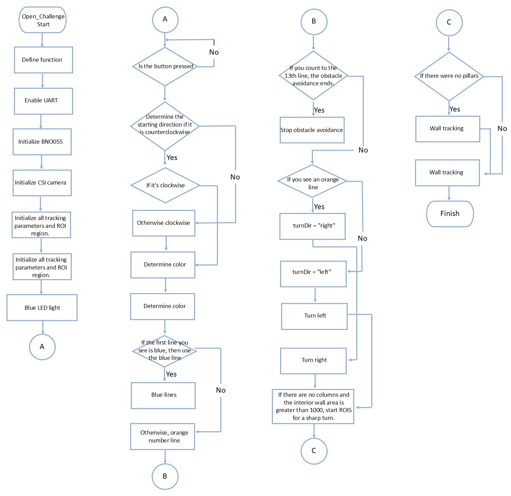
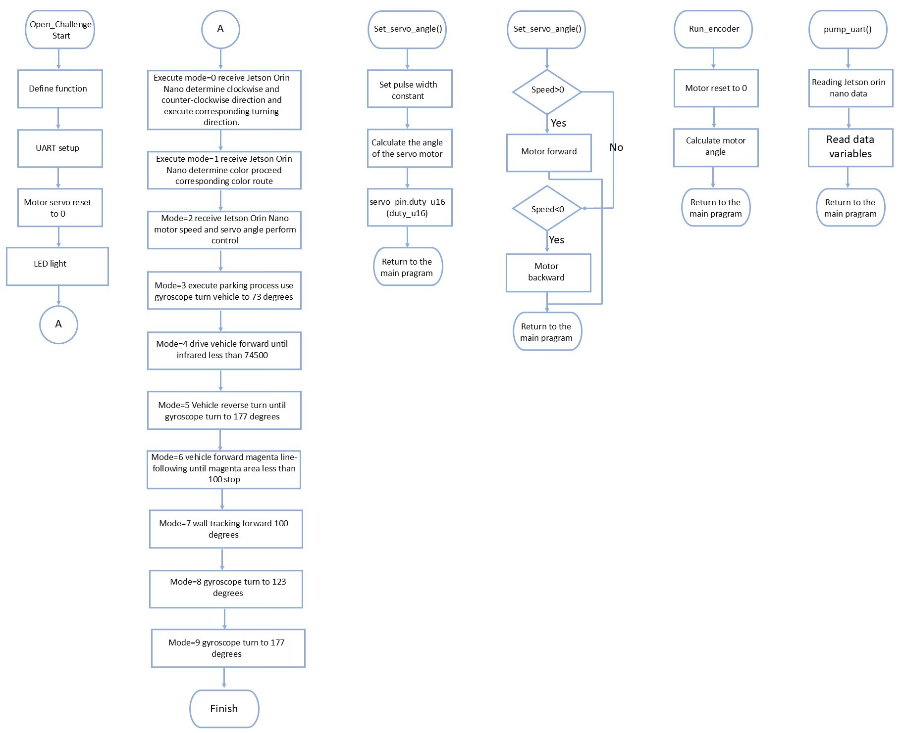

<div align=center>  </div>

## <div align="center">Obstacle_Challenge Code Overview</div> 
根據各控制板的特點，我們對賽車所需的複雜操作進行了分配：

Based on the characteristics of each control board, we distributed the complex operations required for the race vehicle:

   ### 中文:
   1. 這次，Jetson Orin Nano除了具備影像辨識和方向偵測功能外，還新增了障礙物辨識功能。憑藉其強大的運算能力，Jetson Orin Nano能夠進行即時影像分析與處理，精準偵測車輛行駛方向，同時快速辨識並避開路徑上的障礙物，進而提升自動駕駛的穩定性與安全性。
   2. 此外，這次樹莓派 Pico W 不僅要控制直流馬達轉速和車輛轉向，還需要使用紅外線偵測車輛與牆壁的距離。憑藉其高效的 GPIO 控制能力，樹莓派 Pico W 可以進行精確的距離測量和硬體管理，確保車輛安全停放在停車場內，並保持適當的安全距離。
   ### 英文:
   <ol>
   <li>
    This time, in addition to its capabilities in image recognition and direction detection, the Jetson Orin Nano has been enhanced with an obstacle recognition function. Leveraging its powerful computational capabilities, the Jetson Orin Nano can perform real-time image analysis and processing, precisely detect the vehicle's driving direction, and simultaneously quickly identify and avoid obstacles in its path, thereby improving the stability and safety of autonomous driving.
   </li>
   <li>
    Furthermore, the Raspberry Pi Pico W is not only required to control the DC motor speed and vehicle steering this time, but also needs to use infrared sensors to detect the distance between the vehicle and the walls. With its efficient GPIO control capability, the Raspberry Pi Pico W can perform precise distance measurement and hardware management, ensuring the vehicle safely parks within the designated parking lot and maintains an appropriate safety distance.
   </li>
   </ol>

 - ### Jetson Orin Nano library-Jetson Orin Nano 庫
    ### 中文:
    - 影像辨識、影像處理與視覺辨識函式等功能已整合到`functions.py`模組中，可直接導入使用。這些模組的功能如下：


    ### 英文:
    **All functions related to image recognition, image processing, and key visual identification** have been **highly integrated** into the **[function.py](../common/function.py) module** and can be directly **imported and called** by the higher-level program. The **specific functionalities** of these modules are outlined as follows:

    - `display_roi()`此函數的作用是在影像上繪製多個感興趣區域 (ROI) 的邊界框。它接收一個影像 (img)、一個包含多個 ROI 座標的列表 (ROIs)，以及繪製顏色 (color)。它透過繪製四條線段來組成每個 ROI 的矩形邊界，然後返回被標記過的影像。
    - The **`display_roi()` function** is designed to **visualize** multiple **Regions of Interest (ROIs)** on an image. It accepts the **source image (`img`)**, a **list containing the coordinates of multiple ROIs (`ROIs`)**, and the **drawing color (`color`)** for the boundary boxes as input parameters.Its mechanism involves **drawing four line segments** to form the **rectangular boundary** for each ROI. Upon completion, the function **returns** the processed image marked with the boundary boxes.
      ```
      def display_roi(img, ROIs, color):
      for ROI in ROIs:
          img = cv2.line(img, (ROI[0], ROI[1]), (ROI[2], ROI[1]), color, 4)
          img = cv2.line(img, (ROI[0], ROI[1]), (ROI[0], ROI[3]), color, 4)
          img = cv2.line(img, (ROI[2], ROI[3]), (ROI[2], ROI[1]), color, 4)
      ```
    - **`find_contours()` 函式**旨在**從影像中偵測特定色彩範圍的物體輪廓**。此函式首先**擷取**影像中的**感興趣區域 (ROI)**。接著，它利用 **LAB 顏色空間**與預設的 **`lab_range` 參數**進行**顏色閾值分割**，將該區域轉換為**二值遮罩 (mask)**。為**優化輪廓的精確度**，程式會對遮罩執行**形態學操作**，即**腐蝕 (erode)** 與**膨脹 (dilate)** 處理。最終，函式會從處理完成的遮罩中**提取外部輪廓**並將其**返回**。
    - The **`find_contours()` function** is used to **detect object contours** within a specific color range in an image.It first **extracts** the **Region of Interest (ROI)** portion of the image. It then performs **color thresholding** using the **LAB color space** and the predefined **`lab_range` parameters** to convert this area into a **binary mask**. To **enhance contour accuracy**, the function performs **morphological operations**—specifically **erosion** and **dilation**—on the mask. Finally, the function **extracts the external contours** from the processed mask and **returns** them.
      ```
      def find_contours(img_lab, lab_range, ROI):
          x1, y1, x2, y2 = ROI
          seg = img_lab[y1:y2, x1:x2]
          lo = np.array(lab_range[0]); hi = np.array(lab_range[1])
          mask = cv2.inRange(seg, lo, hi)
          k = np.ones((5,5), np.uint8)
          mask = cv2.erode(mask, k, iterations=1)
          mask = cv2.dilate(mask, k, iterations=1)
          contours = cv2.findContours(mask, cv2.RETR_EXTERNAL, cv2.CHAIN_APPROX_SIMPLE)[-2]
          return contours
      ```
    - `max_contour()` 函式旨在從輸入的輪廓列表 (contours) 中，識別並選取面積最大的有效目標輪廓。此函式首先**篩選**掉所有**面積小於 150 的雜訊輪廓**。對於符合標準的輪廓，它會計算其**面積**以及相對於**原始影像的中心底部座標 (`maxX`, `maxY`)**。最終，函式會**返回**最大面積的數值、其對應的校正座標，以及該**輪廓物件本身**，作為車輛進行**循跡導航或目標識別**的關鍵依據。
    - The **`max_contour()` function** is used to **identify and select the largest valid target contour** from an input **list of contours (`contours`)**.The function first **filters out** all **noise contours** with an **area less than 150**. For the qualified contours, it calculates their **area** and the **center-bottom coordinates (`maxX`, `maxY`)** relative to the original image. Finally, the function **returns** the value of the largest area, its corresponding corrected coordinates, and the **contour object itself**, serving as the key basis for the vehicle's **line following or target recognition**.
      ```
      def max_contour(contours, ROI):
          maxArea = 0; maxY = 0; maxX = 0; mCnt = 0
          for cnt in contours:
              area = cv2.contourArea(cnt)
              if area > 150:
                  approx = cv2.approxPolyDP(cnt, 0.01*cv2.arcLength(cnt, True), True)
                  x,y,w,h = cv2.boundingRect(approx)
                  x += ROI[0] + w//2
                  y += ROI[1] + h
                  if area > maxArea:
                      maxArea = area; maxY = y; maxX = x; mCnt = cnt
          return [maxArea, maxX, maxY, mCnt]
      ```
    - **`pOverlap()` 函式**用於在影像的**特定感興趣區域 (ROI)** 中，**偵測包含黑色和洋紅色組合的複合輪廓**，主要應用於牆壁或特殊標記的識別。此函式根據布林參數 `add` 的值，來決定如何處理這兩種顏色的區域：
      1.  **若 `add=True`：** 函式會將**黑色區域與洋紅色區域進行邏輯合併 (Union)**，以尋找融合後的複合輪廓。
      2.  **若 `add=False`：** 函式會尋找**純黑色區域**，即**從黑色區域中減去 (Subtract) 被洋紅色覆蓋的部分**。
    - 無論選擇哪種組合方式，函式都會對最終產生的遮罩執行**運算（通常指腐蝕和膨脹）**處理來**優化輪廓形狀**，最後**提取並返回外部輪廓**。
    - The **`pOverlap()` function** is used to **detect composite contours** that involve a combination of black and magenta within a **specific Region of Interest (ROI)** in an image, primarily intended for the detection of walls or special markers.The function determines how to combine these two color regions based on the boolean parameter `add`:
      1.  **If `add=True`:** The function **logically combines (Union)** the black and magenta areas to find the resulting composite contours.
      2.  **If `add=False`:** The function searches for the **pure black area**, which means **subtracting the portion covered by magenta from the black area**.
    - In either scenario, the function performs **morphological operations (implied erosion and dilation)** on the resulting mask to **optimize the contour shape**. Finally, it **extracts and returns the external contours**.
      ```
      def pOverlap(img_lab, ROI, add=False):
          x1, y1, x2, y2 = ROI
          seg = img_lab[y1:y2, x1:x2]
          from masks import rBlack, rMagenta
          loB, hiB = np.array(rBlack[0]),   np.array(rBlack[1])
          loM, hiM = np.array(rMagenta[0]), np.array(rMagenta[1])
          mB = cv2.inRange(seg, loB, hiB)
          mM = cv2.inRange(seg, loM, hiM)
          if add:
              mask = cv2.add(mB, mM)
          else:
              mask = cv2.bitwise_and(mB, cv2.bitwise_not(mM))
          k_open  = np.ones((3,3), np.uint8)
          k_close = np.ones((7,7), np.uint8)
          mask = cv2.morphologyEx(mask, cv2.MORPH_OPEN,  k_open,  iterations=1)
          mask = cv2.morphologyEx(mask, cv2.MORPH_CLOSE, k_close, iterations=1)
          contours = cv2.findContours(mask, cv2.RETR_EXTERNAL, cv2.CHAIN_APPROX_SIMPLE)[-2]
          return contours
      ```


 - ### Overview of the Jetson Orin Nano Obstacle Challenge Code - Jetson Orin Nano 障礙挑戰程式碼概述
   - #### Obstacle Challenge Code Jetson Orin Nano Library - 障礙挑戰程式碼程式 Jetson Orin Nano 函式庫
    
      ```
      import os, sys                                                          
      sys.path.append(os.path.abspath(os.path.dirname(__file__)))                      
      import cv2, time, math, sys, numpy as np                                         
      from masks import rMagenta, rRed, rGreen, rBlue, rOrange, rBlack                 
      from functions_jetson import * 
      ```  

   - #### Introduction to Running Programs on the Jetson Orin Nano Controller: - Jetson Orin Nano 控制器程式運作簡介：

      - ##### [jetson_Orin_Nano_final.py](./jetson_orin_nano_final.py)
      ### 中文:
        - 自駕車系統的啟動流程採**主從協作機制**：Jetson Orin Nano 啟動後，**樹莓派 Pico W** 即進入**硬體待命狀態**。當使用者按下**實體啟動開關**後，Jetson Orin Nano 接收到啟動訊號，並發送**高電平訊號**以啟動其核心程式 **`jetson_Orin_Nano_final.py`**。此主程式全面負責**綜觀調度**整個自動駕駛任務的執行流程。其核心功能涵蓋**避開牆壁（循牆導航）**、**精確的方向控制（轉向決策）**、**動態的障礙物躲避**以及**圈數計數**。程式運行後，便透過 **UART 介面**持續將計算出的**舵機（轉向）**和**直流馬達（驅動）**數據傳送給樹莓派 Pico W 執行，從而**保障行駛的穩定性與任務的完整性**，確保車輛按預定計畫完成所有競賽任務。

        - 程式啟動之初，車輛會優先執行**停車區出發模式 (Parking Lot Exit Mode)**。在此模式下，避障系統會**即時計算**偵測到的**柱子或邊牆範圍**，並將此範圍轉換為**伺服馬達的轉向角度**。隨後，系統利用此角度進行 **PD 轉向控制**，以確保車輛能**穩定地離開停車區**，並**避免與牆壁發生任何碰撞**。當車輛接近**轉彎區域**時，系統會**偵測賽道上的藍色或橘色線條**，以作為**切換至轉彎模式**的判斷依據。
        
        - 在**直線循跡模式 (Straight Line Following Mode)** 中，系統會優先以**紅色與綠色柱子**（透過 `detect_color_final()` 函式計算出的**中心偏差**）作為**主要的轉向校正依據**。僅當**未檢測到任何色塊**時（判斷條件為 `cPillar.area == 0`），系統才會啟用**兩側牆壁的輪廓面積差異**，將其作為**輔助性的循跡校正參考**。
        
        - 在**直線循跡模式**下，系統會持續監測**影像感興趣區域 (ROI4)**，一旦偵測到賽道上的**藍色或橘色線條**，即以此觸發訊號，**設定 `rTurn` 或 `lTurn` 旗標**，**進入轉彎模式**。轉彎模式啟動後，**伺服舵角即被鎖定於固定值**。而**判斷轉彎是否完成**並**切換回直線循跡模式**的完整依據是：車輛在轉彎期間持續利用**視覺看牆**的方式，確認**內牆的輪廓面積**是否**大於預設閾值**（例如：**4000**）。一旦內牆面積確認符合此條件，系統即判定轉彎結束，並**立即返回直線循跡模式**。
        ### 英文:
        - The startup process of the self-driving car system employs a **master-slave collaboration mechanism**: After the Jetson Orin Nano boots up, the **Raspberry Pi Pico W** immediately enters a **hardware standby state**. Upon the user pressing the **physical start switch**, the Jetson Orin Nano receives the activation signal and transmits a **high-level signal** to initiate its core program, **`jetson_Orin_Nano_final.py`**.This main program is entirely responsible for **supervising and coordinating** the execution flow of the entire autonomous driving mission. Its core functionalities encompass **wall avoidance (wall following navigation)**, **precise direction control (steering decision-making)**, **dynamic obstacle evasion**, and **lap counting**. Once running, the program continuously transmits the calculated **servo motor (steering)** and **DC motor (drive)** data to the Raspberry Pi Pico W via the **UART interface** for execution, thereby **guaranteeing driving stability and mission integrity** and ensuring the vehicle completes all competition tasks according to the predetermined plan.

        - Upon program startup, the vehicle first executes the **Parking Lot Exit Mode**. In this mode, the obstacle avoidance system **calculates in real-time** the range of the detected **pillars or side walls**, converting this range into a **steering angle for the servo motor**. Subsequently, this angle is used for **PD steering control** to ensure the vehicle **stably exits the parking zone** and **avoids any collision with the walls**. As the vehicle approaches a **turning area**, the system will **detect the blue or orange lines on the track** to serve as the criterion for **switching to the turning mode**.

        - In the **Straight Line Following Mode**, the system prioritizes using the **red and green pillars** (specifically, the **center deviation** calculated by the `detect_color_final()` function) as the **primary reference for steering correction**. Only when **no color blocks are detected** (under the condition `cPillar.area == 0`) does the system activate the **area difference of the side walls** as an **auxiliary reference for line following correction**.

        - While in **Straight Line Following Mode**, the system continuously monitors the **Region of Interest (ROI4)** for the detection of **blue or orange lines** on the track. This detection serves as the trigger signal, **setting the `rTurn` or `lTurn` flag to initiate the turning mode**.Once the turning mode is activated, the **servo steering angle is locked to a fixed value**. The complete criterion for **determining whether the turn is complete** and **switching back to the straight line following mode** is as follows: The vehicle continuously uses **visual wall perception** during the turn to confirm whether the **contour area of the inner wall** is **greater than a preset threshold** (e.g., **4000**). Once the inner wall area is confirmed to satisfy this condition, the system determines the turn is complete and **immediately returns to the straight line following mode**.

      __Program operation flow__ - 程式運行流程
        ### 中文:
        - jetson_Orin_Nano_final.py程式開始執行，初始化所有變量，並進入循環，持續從 find_contours 和 max_contour 函數中獲取數據，然後根據當前狀態進入不同的條件分支以執行相應的控制操作。在每個循環中，程式將jetson_Orin_Nano_final.py計算出的直流馬達值、伺服馬達角度和當前狀態打包成二進位數據，並透過UART將其發送到 Raspberry Pi Pico W 控制。
        ### 英文:
        - `jetson_nano_main_fianl.py` starts execution, initializes all variables, and enters a loop, continuously retrieving data from process_roi and detect_color, then entering different conditional branches based on the current state to perform the appropriate control actions. In each loop, `jetson_nano_main_final.py` packages the calculated DC motor value, servo motor angle, and current status into binary data and sends it to the Raspberry Pi Pico via UART. 

   - ##### Program Operation flowchart of the Jetson Orin Nano controller
     

 - ### Obstacle_Challenge Code Overview of Raspberry Pi Pico W-樹莓派 Pico W 障礙挑戰代碼概述
   - ####  Obstacle_Challenge Code Program Raspberry Pi Pico W Libraries-障礙挑戰程式碼程式 Raspberry Pi Pico W函式庫
    
      ```
      from machine import Pin, PWM, UART,I2C,time_pulse_us
      import time
      import struct
      ```  
     
   - #### Introduction to running programs on the Raspberry Pi Pico W controller:-樹莓派 Pico W 控制器程式運作簡介：
      ### 中文:
      - `pico_main_final.py` 程式運行在 Raspberry Pi Pico 控制器上，作為自動駕駛車輛的中間控制系統，管理直流馬達和伺服馬達的運作。該程式透過UART從Jetson Orin Nano控制器接收計算結果，並控制後輪直流馬達的轉速、前輪伺服馬達的角度，同時監控車輛狀態參數。


      - 在控制後輪直流馬達時，我們使用 L293D 驅動晶片，透過 PWM 的佔空比調節電壓，實現後輪直流馬達的轉速控制。此外，透過設定 L293D 上的兩個控制引腳（20 和 21）的高低電平，可以控制後輪直流馬達的正反轉。

      - 在控制前輪伺服馬達時，我們直接利用PWM訊號的佔空比來調節輸出，從而控制伺服馬達的轉向角度， PWM訊號佔空比的變化對應伺服馬達的不同角度設置，實現精準轉向。

      - 當程式運作至count=1時，系統接管直流馬達的控制權，並開始轉彎往前走直到紅外線感測到牆壁再進行後退轉彎追蹤停車區域的洋紅色。在追蹤過程中，會一直沿著洋紅色循跡直到如果洋紅色面積<100，在使用牆壁循跡往前100度，在使用陀螺儀轉彎進入停車區，以確保精準停車。
      ### 英文:
      - ##### [pico_main_final.py](./pico_main_final.py)
        - The `pico_main_final.py` program runs on the Raspberry Pi Pico controller as an intermediary control system for an autonomous vehicle, managing the operation of the DC motor and servo motor. This program receives computation results from the Jetson Orin Nano controller via UART and controls the speed of the rear-wheel DC motor, the angle of the front-wheel servo motor, while also monitoring vehicle status parameters.
        -  When the start switch is pressed, the Raspberry Pi Pico controller receives a start signal and sends a high-level signal to initiate the main program `jetson_nano_main_final.py` on the Jetson Orin Nano.
        - When controlling the rear-wheel DC motor, we adjust the voltage through the duty cycle of PWM, using the L293D driver chip to achieve speed control of the rear-wheel DC motor. Additionally, by setting the high and low levels of the two control pins (20,21) on the L293D, we can control the forward and reverse rotation of the rear-wheel DC motor.
        - When controlling the front-wheel servo motor, we directly use the duty cycle of the PWM signal to adjust the output and control the steering angle of the servo motor, without the need for an L293D driver. Changes in the PWM signal’s duty cycle correspond to different angle settings for the servo motor, allowing for precise steering.
        - When the program reaches state five, the system takes over the control of the DC motor and begins tracking the pink sidewall of the parking area. During tracking, the ultrasonic distance sensor detects the parking area; when the sensor detects that the sidewall is pink, the system simultaneously takes control of both the servo motor and the DC motor. It then uses `run_encoder_Auto()` to adjust the forward angle of the DC motor to ensure precise parking.
      

      __Program operation flow__-程式運行流程
        ### 中文:
        - Jetson Orin Nano程式啟動後，樹莓派 Pico w 會進入等待狀態，直到Jetson Orin Nano按下按鈕後進入 jetson_Orin_Nano_final.py程式，並透過UART發送馬達數據給樹莓派 Pico w 運行。
        ### 英文:
        - When  `pico_main_final.py` starts, it sends a high-frequency signal to the Jetson Orin Nano to trigger the execution of the `jetson_nano_main_final.py` program. Then, `pico_main_final.py` enters a waiting mode until the button is pressed. After pressing the button,`pico_main_final.py` enters the main loop, starts receiving data transmitted via UART from the Jetson Orin Nano, and continues running. When it receives a status value of 5, the Pico takes over vehicle control and performs the parking operation.

    - ##### Program Operation flowchart of the Raspberry Pi Pico W controller-樹莓派 Pico W 控制器的程式操作流程圖
        

       **set_servo_angle():** <br>
          - 計算並轉換±180度的角度值到伺服馬達所需的PWM佔空比範圍（0到65535），並將其輸出到前輪伺服馬達。

        __control_motor():__<br>
          - 取-100到100範圍內一個數的絕對值，轉換為PWM佔空比。同時，根據該值的符號設定兩個引腳的高低狀態，以控制馬達的正反轉或停止。

        __run_encoder_Auto():__<br>
          - 在此函數中run_encoder()，伺服馬達角度被設定為固定值，以車輛操作期間保持車輛位置和方向的穩定控制。
       </ol>
# <div align="center">[Return Home](../../../)</div>  
