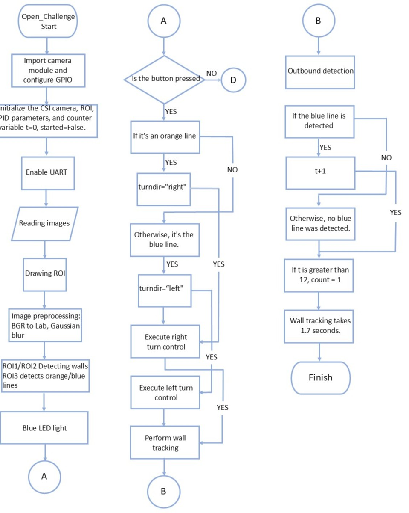
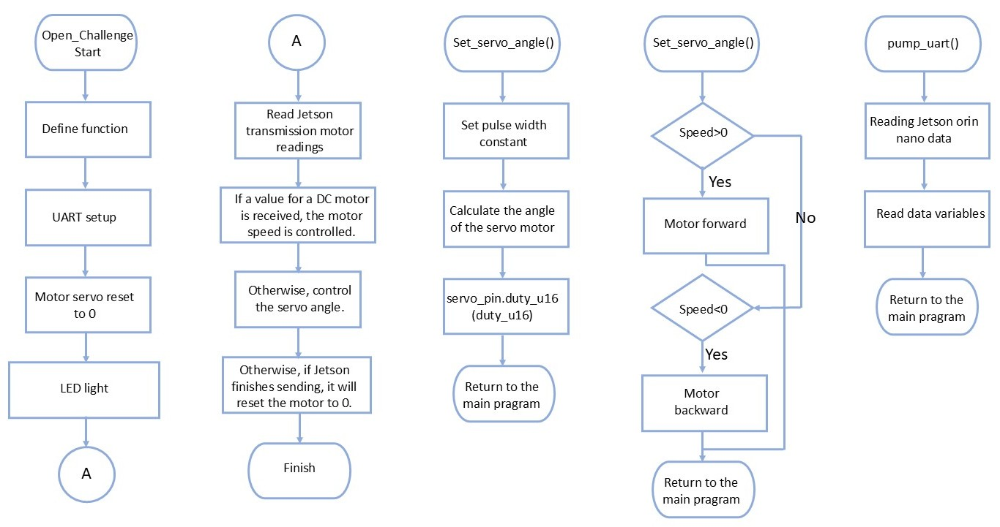

<div align=center>  </div>

## <div align="center">Open Challenge Code Overview</div> 
  Based on the characteristics of each control board, we distributed the complex operations required for the race vehicle:
  ### 中文:
   1. Jetson Orin Nano 核心處理影像辨識與行駛方向判斷，憑藉其強大的運算性能實現即時影像分析。
   2. 樹莓派 Pico W 則同步負責馬達驅動及車輛轉向，利用其高效的 GPIO 控制功能達成精準的硬體管理。
   3. 此種專業分工的架構能最大化各控制板的專長優勢，進而讓整個系統運行更為穩定且高效。
   ### 英文:
   <ol>
   <li>
    The Jetson Orin Nano is primarily responsible for image recognition and driving direction determination, leveraging its powerful computational capabilities to perform real-time image analysis.     
   </li>
   <li>
    The Raspberry Pi Pico W handles the motor drive and vehicle steering, utilizing its efficient GPIO control functions to achieve precise hardware management.
   </li>
   <li>
    This specialized division of labor architecture maximizes the unique strengths of each control board, resulting in a system that operates with enhanced stability and efficiency.
   </li>
   </ol>

 - ### Jetson Orin nano library - Jetson Orin nano庫
    The core functions for image recognition and ground line color recognition have been fully integrated into the [function.py](../common/function.py) module and can be directly imported and called for use. The specific functions of these modules are listed as follows:
    - `find_contours()`: Process image data to identify objects or features of specific colors in the scene.(處理影像資料以識別場景中的特定顏色物體或特徵。)
      ```
      def find_contours(img_lab, lab_range, ROI):
        x1, y1, x2, y2 = ROI
        seg = img_lab[y1:y2, x1:x2]
        lo = np.array(lab_range[0]); hi = np.array(lab_range[1])
        mask = cv2.inRange(seg, lo, hi)
        k = np.ones((5,5), np.uint8)
        mask = cv2.erode(mask, k, iterations=1)
        mask = cv2.dilate(mask, k, iterations=1)
        contours = cv2.findContours(mask, cv2.RETR_EXTERNAL, cv2.CHAIN_APPROX_SIMPLE)[-2]
        return contours
      ```
    - `max_contour()`: This function filters the input list of contours by selecting those with an area greater than a specific threshold, then identifies the largest contour among them, calculates its centroid coordinates,and finally returns this largest contour's area, coordinates, and the contour itself.(從輸入的輪廓列表中，篩選出面積大於特定閾值的輪廓，並找出其中面積最大的輪廓，計算其中心點座標，最終回傳此最大輪廓的面積、座標與輪廓本身。)
      ```
      def max_contour(contours, ROI):
          maxArea = 0; maxY = 0; maxX = 0; mCnt = 0
          for cnt in contours:
              area = cv2.contourArea(cnt)
              if area > 150:
                  approx = cv2.approxPolyDP(cnt, 0.01*cv2.arcLength(cnt, True), True)
                  x,y,w,h = cv2.boundingRect(approx)
                  x += ROI[0] + w//2
                  y += ROI[1] + h
                  if area > maxArea:
                      maxArea = area; maxY = y; maxX = x; mCnt = cnt
          return [maxArea, maxX, maxY, mCnt]
      ```             

 - ### Jetson Orin Nano Open Challenge Code Overview - Jetson Orin nano 開放挑戰程式碼概述
   - #### Jetson Orin Nano Core Library Open Challenge Code Plan - Jetson Orin nano 函式庫的開放挑戰程式碼計劃
    
```
import os, sys                                                                 
sys.path.append(os.path.abspath(os.path.dirname(__file__)))                      
import cv2, time, math, sys, numpy as np                                         
from masks import rMagenta, rRed, rGreen, rBlue, rOrange, rBlack                 
from functions_jetson import * 
```  

   - #### Introduction to running programs on the Jetson Orin nano controller:

      - ##### [jetson_orin_nano_main.py](./jetson_orin_nano_main.py)
      ### 中文:
      - `jetson_nano_main.py` 主程式負責掌控整體任務流程，包含避牆導航、轉向控制及圈數計數等核心功能。
      - 系統啟動流程： Jetson Orin Nano 啟動後，樹莓派 Pico W 會進入待命狀態。當使用者按下實體啟動開關後，Jetson Orin Nano 接收到啟動訊號，隨即發送高電平訊號來啟動 `jetson_nano_main.py` 主程式。主程式運行後，便透過 UART 介面持續將舵機（轉向）和直流馬達（驅動）的數據傳送給樹莓派 Pico W 執行。
      - 直線行駛模式 (Wall Following): 程式啟動時，車輛預設進入直線行駛模式。在此模式下，系統會將計算出的邊牆範圍轉換為伺服馬達的精確轉向角度，並利用 PD 控制演算法確保車輛能穩定循跡，避免碰撞牆壁。
      - 轉彎模式切換 (Curve Detection): 當車輛接近彎道時，系統會偵測賽道上的藍色或橘色線條，一旦偵測到這些線條，即自動切換至轉彎模式。
      - 轉彎與模式返回： 在轉彎模式下，伺服馬達的角度保持固定不變，車輛仍利用視覺看牆的方式進行輔助判斷。當系統確認內牆面積（inner wall area）大於 4000 時，即認定轉彎完成，隨即返回直線行駛模式。
      ### 英文:
      - The `jetson_nano_main.py` primary program is responsible for controlling the overall mission flow, encompassing core functions such as wall avoidance navigation, steering control, and lap counting.
      - System Startup Process: After the Jetson Orin Nano boots up, the Raspberry Pi Pico W enters a waiting state. Upon the user pressing the physical start switch, the Jetson Orin Nano receives the activation signal and immediately transmits a high-level signal to initiate the `jetson_nano_main.py` main program. Once running, the main program continuously sends servo motor (steering) and DC motor (drive) data to the Raspberry Pi Pico W via the UART interface for execution.
      - Straight Driving Mode (Wall Following): When the program starts, the vehicle defaults to the straight driving mode. In this mode, the system converts the calculated side wall range into a precise steering angle for the servo motor, utilizing a PD control algorithm to ensure stable tracking and prevent collisions with the walls.
      - Curve Mode Transition (Curve Detection): As the vehicle approaches a curve, the system detects the blue or orange lines on the track. Once these lines are detected, the system automatically switches to the turning mode.
      - Turning and Mode Return: In the turning mode, the servo motor angle remains fixed, and the vehicle still uses visual wall perception for auxiliary judgment. The turning is deemed complete when the system confirms that the inner wall area is greater than 4000, upon which the vehicle immediately returns to the straight driving mode.

      ### Program operation flow - 程式運行流程
      ### 中文:
      - jetson_nano_main.py程式開始執行，初始化所有變量，並進入循環，持續從 find_contours和max_contour 函數中獲取數據，然後根據當前狀態進入不同的條件分支以執行相應的控制操作。在每個循環中，程式將jetson_nano_main.py計算出的直流馬達值、伺服馬達角度和當前狀態打包成二進位數據，並透過UART發送到 Raspberry Pi Pico w 控制。 
      ### 英文:
       - jetson_nano_main.py starts execution, initializes all variables, and enters a loop, continuously retrieving data from process_roi and detect_color, then entering different conditional branches based on the current state to perform the appropriate control actions. In each loop, jetson_nano_main.py packages the calculated DC motor value, servo motor angle, and current status into binary data and sends it to the Raspberry Pi Pico via UART.

   - ##### Jetson Orin Nano控制器的程式操作流程圖
     

 - ### 樹莓派 Pico W 公開挑戰代碼概述
   - #### 樹莓派 Pico W 庫開放挑戰程式碼程序
    
      ```
      from machine import Pin, PWM, UART,I2C,time_pulse_us
      import time
      import struct
      ```  
     
   - #### 樹莓派 Pico W 控制器程式運作簡介:

      - ##### [pico_main.py](./pico_main.py)
      ### 中文:
          
      - 在控制後輪直流馬達時，我們透過調節PWM的佔空比來控制電壓，並使用L293D驅動晶片來實現後輪直流馬達的速度控制。此外，透過設定L293D晶片上兩個控制引腳（20、21）的高低電平，我們可以控制後輪直流馬達的正反轉。
      - 在控制前輪伺服馬達時，我們直接利用PWM訊號的佔空比來調整輸出，進而控制伺服馬達的轉向角度，PWM訊號佔空比的變化對應於伺服馬達的不同角度設置，從而實現精確轉向。
        ### 英文:
        - The `pico_main.py` program runs on the Raspberry Pi Pico controller as an intermediary control system for an autonomous vehicle, managing the operation of the DC motor and servo motor. This program receives computation results from the Jetson Orin nano controller via UART and controls the speed of the rear-wheel DC motor, the angle of the front-wheel servo motor, while also monitoring vehicle status parameters.
        -  When the start switch is pressed, the Raspberry Pi Pico controller receives a start signal and sends a high-level signal to initiate the main program `jetson_orin_nano_main.py` on the Jetson Orin nano.
        - When controlling the rear-wheel DC motor, we adjust the voltage through the duty cycle of PWM, using the L293D driver chip to achieve speed control of the rear-wheel DC motor. Additionally, by setting the high and low levels of the two control pins (20,21) on the L293D, we can control the forward and reverse rotation of the rear-wheel DC motor.
        - When controlling the front-wheel servo motor, we directly use the duty cycle of the PWM signal to adjust the output and control the steering angle of the servo motor, without the need for an L293D driver. Changes in the PWM signal’s duty cycle correspond to different angle settings for the servo motor, allowing for precise steering.
      

      - ##### Program Operation flowchart of the Raspberry Pi Pico W controller
        
        
          __set_servo_angle():__<br>
          - 計算並轉換±180度的角度值到伺服馬達所需的PWM佔空比範圍（0到65535），並將其輸出到前輪伺服馬達。
                    
          __control_motor():__<br>
          - 取-100到100範圍內一個數的絕對值，轉換為PWM佔空比。同時，根據該值的符號設定兩個引腳的高低狀態，以控制馬達的正反轉或停止。

          __run_encoder():__<br>
          - 透過讀取直流馬達的目前值來計算其旋轉角度，並根據計算結果設定條件，控制馬達直線旋轉至指定的旋轉角度。這種設計能夠實現精確的馬達調節，確保車輛在運行過程中平穩移動，並準確達到預期的目標角度。

 

# <div align="center">[Return Home](../../../)</div>  
