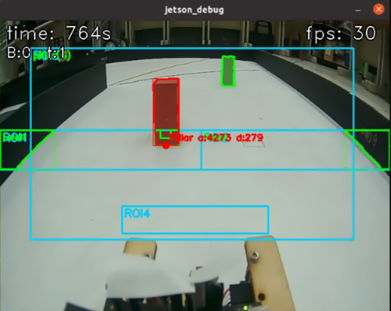
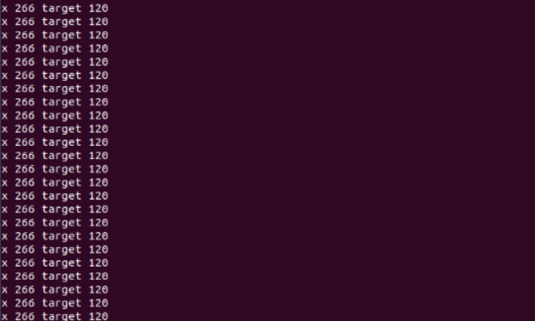

<div align=center>  </div>

## <div align="center">Steering Control Overview-轉向控制概述</div> 

 - ### Vehicle steering control-車輛轉向控制
    ### 中文:
    1. **方向判斷**:
     - 若偵測到橘線的輪廓面積 (maxO) 超過閾值 (> 110)，則判斷為右轉 ("right")。
     - 若偵測到藍線的輪廓面積 (maxB) 超過閾值 (> 110)，則判斷為左轉 ("left")。
    2. **彎道進入訊號**:
      - 一旦確認了轉向方向，且偵測到對應的標線（例如，方向為右轉時，maxO > 100），則會設置轉向訊號旗標 (tSignal = True)，同時設置 rTurn 或 lTurn 旗標。
    3. **轉彎輔助偵測**:
      - 當如果任何一側牆壁輪廓面積 (leftArea 或 rightArea)面積超過1000時，會自動設定一個較小的ROI5區域([270, 110, 370, 150])用於強化黑色和洋紅色輪廓的偵測，當ROI5接觸到外牆會將轉向角度變大進行轉彎防止撞上外牆。
    ### 英文:
    - When the vehicle detects a blue or orange line on the ground, the system triggers a steering action. Highlighted value detection of the sidewall ensures the vehicle maintains a safe distance to avoid collisions, while the blue and orange line detection identifies the vehicle’s turning direction, allowing it to navigate curves or corners safely and precisely.
    - As the vehicle moves, the system uses the camera to detect highlighted values and the blue and orange lines on the ground. When approaching a turn, the system assesses the y-axis position of the blue and orange lines and uses these values to determine the proximity of the turn. The closer the distance, the larger the y-axis value. The system selects the color with the largest y-axis value as the basis for steering direction, ensuring accurate turning.
    - After determining the turning direction, the system further evaluates the highlighted values on the left and right sides of the camera view. The turn action only initiates when the highlighted value reaches or exceeds 4500. This setup effectively prevents premature turning, reducing the risk of the vehicle hitting the sidewall due to early steering, and ensures accuracy and safety in turning.
        - program code:
    ```
    if turnDir == "none":
      if maxO > 110:
        turnDir = "right"
      elif maxB > 110:
        turnDir = "left"
    if (turnDir == "right" and maxO > 100) or (turnDir == "left" and maxB > 100):
      t2 = t
      if t2 == 7 and not pillarAtStart:
        ROI3[1] = 110
      if cPillar.area != 0 and ((leftArea > 1000 and turnDir == "left") or (rightArea > 1000 and turnDir == "right")):
        ROI5 = [270, 110, 370, 150]
      if turnDir == "right":
        rTurn = True
    else:
      lTurn = True
      if t == 0 and pillarAtStart == -1:
        pillarAtStart = True if ((startArea > 2000 and startTarget == greenTarget) or (startArea > 1500 and startTarget == redTarget)) else False
        tSignal = True
      elif (turnDir == "left" and maxO > 100) or (turnDir == "right" and maxB > 100):
        if t2 == 11:
          s = 2
          sTime = time.time()
    ```
     <div align=center>
        <table>
        <tr>
        <th>Blue Line Recognition(藍線偵測)</th>
        <th>Orange Line Recognition(橘線偵測)</th>
        </tr><tr>
        <td></td>
        <td></td>
        </tr>
        </table>
        </div>
     <div align=center>
        <table>
        <tr>
        <th>Turning with traffic signals(有交通號誌轉彎)</th>
        <th>Turning without traffic signals(沒有交通號誌轉彎)</th>
        </tr><tr>
        <td></td>
        <td></td>
        </tr>
        </table>
        </div>
     <div align=center>
        <table>
        <tr>
        <th>ROI5 assists in corner detection before turning.(轉彎前ROI5輔助轉彎偵測)</th>
                <th>ROI 5 assisted turning detection(ROI5輔助轉彎偵測)</th>
        </tr><tr>
        <td></td>
        <td></td>
        </tr>
        </table>
        </div>   

  
</div> 

- ### Vehicle block avoidance control-車輛避障控制

  ### 中文:
   - 根據任務需求，當車輛偵測到紅色交通號誌遮擋時，系統觸發向右繞行機動；當遇到綠色障礙物時，它會觸發向左繞行機動。 
   - 當車輛移動時，攝影機將視訊傳送到控制器（Jetson Orin Nano），然後控制器進行影像處理以目標柱子在畫面中的理想 X 座標位置。這些數據可協助控制器確定物體的位置和距離，從而實現精確導航和避障。
   - 在拍攝的影像上繪製一個矩形，boundingRect()並傳回該矩形左上角的 x 和 y 座標。將其應用於訊號柱的輪廓時，即可用於確定其位置。

  - 車輛透過以下步驟完成避開交通號誌的操作：
    1. 如果螢幕上出現兩根或多根柱子，我們會計算螢幕底部中心點到柱子底部中心點的距離。我們使用距離最近的柱子來計算伺服角度。
    2. 根據柱子的 x 座標與目標 x 座標的差值進行 PD 控制計算。綠色立柱的目標 x 座標設定在較右側，因為車輛需由左側通過，紅色立柱則相反，目標位置偏向左側。
    3. 在偵測到柱子的同時，若左側或右側牆壁的面積過大，我們會取消當前柱子的選擇，改由牆壁面積決定轉向角度。這樣可以讓車子朝中間轉動，避免撞上牆壁。
    
   ### 英文:
  - According to task requirements, when the vehicle detects a red traffic signal block, the system triggers a rightward bypass maneuver; when it encounters a green block, it triggers a leftward bypass maneuver.
  - As the vehicle moves, the camera transmits video to the controller (Jetson Nano), which then performs image processing to obtain the X and Y coordinates and the area size of objects in the frame. This data helps the controller determine the position and distance of objects for accurate navigation and obstacle avoidance.
  - Quadratic Bézier curves in red and green are drawn on the captured image to guide the vehicle toward the traffic signal and accurately position the block along the curve.
  
- The vehicle completes the traffic signal block avoidance through the following steps:
    
    1. The system detects traffic signal blocks through the camera and uses image recognition to analyze the y-coordinate, area, and color of the blocks, thereby determining the position of the block closest to the vehicle.
    2. Next, the system obtains the X-coordinate of the nearest block and compares it with the corresponding X-coordinate on the Bézier curve to calculate the X-axis deviation. The deviation is then multiplied by a preset avoidance coefficient to determine the final error value.
    3. Finally, based on the calculated error value, the servo motor's turning direction is adjusted to steer the vehicle appropriately, effectively avoiding the block and ensuring the safety and stability of its driving path.
    
<div align=center>

  |Recognize the color of traffic signal blocks.|The color and X, target coordinates of traffic signal blocks.|
  |:---:|:---:|
  |<div align="center"> </div>|<div align="center"> </div>|

# <div align="center">[Return Home](../../)</div>  


