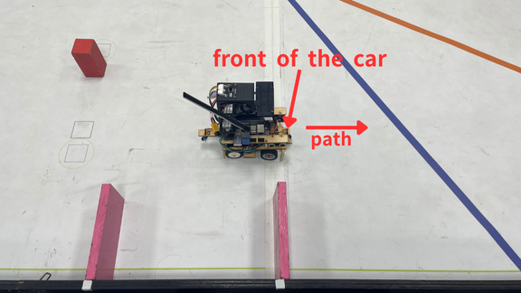
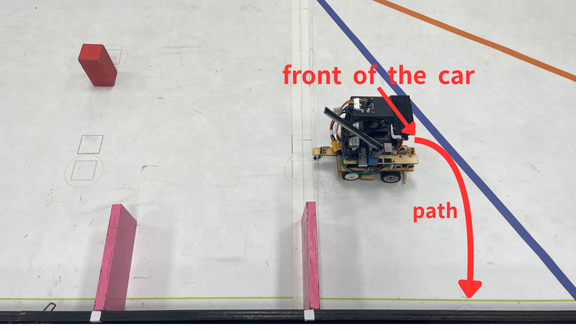
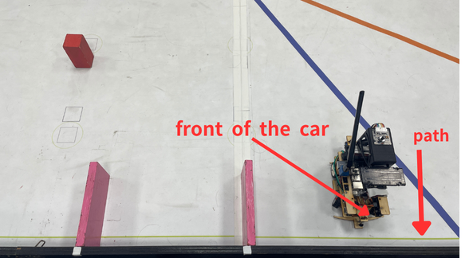
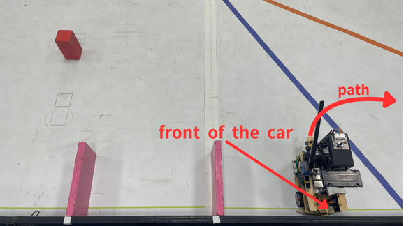
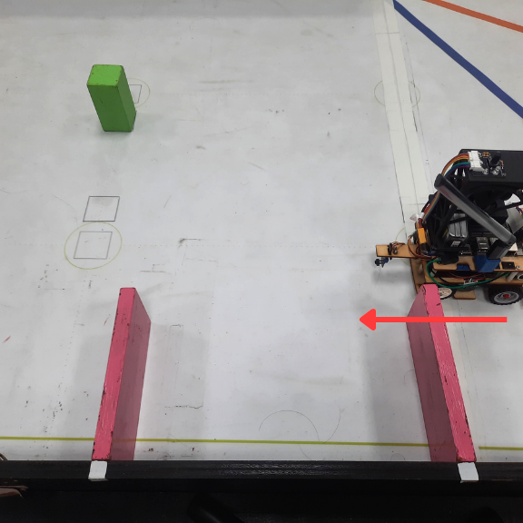
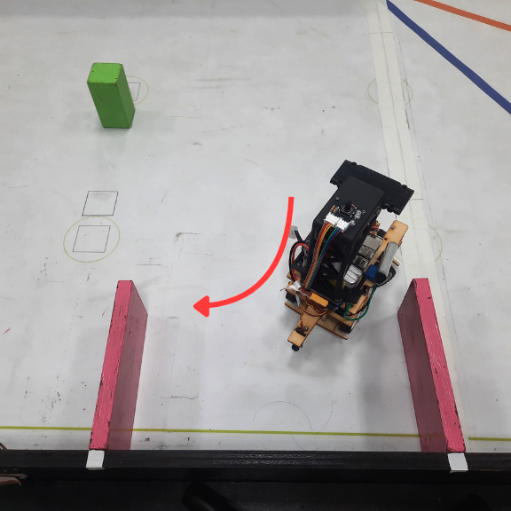
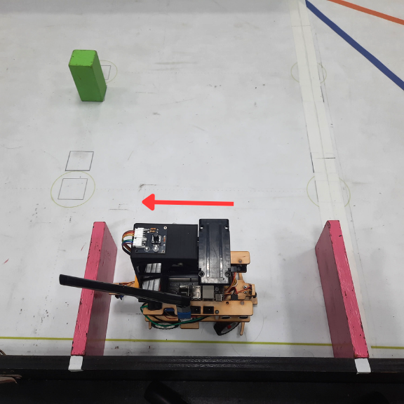

<div align="center"></div>

## <div align="center">Description of the Parking Method - 停車方法說明</div>
  **Code Logic Description: Parking Task After Three Laps - 程式碼邏輯說明：三圈後停車任務。**
- ### Parking program-停車計劃
    ### 中文:
    1.  **停車區識別與入庫準備 (Jetson Orin Nano)**
      * 在車輛行駛過程中，**Jetson Orin Nano 系統**持續透過攝影機偵測**洋紅色方塊**以識別**停車場的精確位置**。
      * 當車輛**完成第三圈**時，自駕車會執行**轉彎動作進入停車區**，並持續**向前行駛**，直到**紅外線感測器偵測到牆壁**。此時，車輛隨即執行**後退轉彎**，並開始調整車體朝向停車場的精確方向。
    2.  **精準定位與入庫起始 (Jetson Orin Nano)**
      * 車輛朝向停車場區域後，**Jetson Orin Nano** 透過攝影機**即時測量**車輛與**洋紅色停車位標記**之間的**橫向距離**，以確保維持適當的進場間距。
      * 為確認車輛已抵達**精確的入庫起始位置**，程式持續監測攝影機所擷取的**洋紅色標誌面積**。
      * 一旦**洋紅色區域的面積小於 100**，即確認完成定位。車輛隨即**沿牆邊線循跡 100 單位**（或度數），隨後執行**轉入停車位的動作**。
    3.  **平行倒車入庫與姿態控制 (Raspberry Pi Pico W)**
      * 在確認目標停車方向後，系統將執行**模擬真實世界的平行停車**動作。
      * 首先，**Jetson Orin Nano** 計算並設定轉向**伺服馬達的起始角度**及**直流驅動馬達的數值**。
      * 在倒車入庫過程中，**主控單元 (Raspberry Pi Pico W)** 負責**讀取來自 Jetson Orin Nano 的陀螺儀角度數據**（或直接執行姿態控制），以**精確控制車輛的姿態與轉向角度**，並**同步調整伺服馬達**，從而**完成自動平行倒車入庫動作**。
    ### 英文:
    1.  **Parking Zone Identification and Entry Preparation (Jetson Orin Nano)**
      * While the vehicle is driving, the **Jetson Orin Nano system** continuously identifies the **precise location of the parking lot** by detecting the **magenta square** via the camera.
      * When the vehicle **completes the third lap**, the autonomous car executes a **turn to enter the parking zone** and continues to **drive forward** until the **infrared sensor detects a wall**. At this point, the vehicle immediately performs a **reverse turn** and adjusts its body orientation towards the parking lot's precise direction.

    2.  **Precise Positioning and Bay Entry Start (Jetson Orin Nano)**
      * Once the vehicle is oriented towards the parking area, the **Jetson Orin Nano** **measures the lateral distance** between the vehicle and the **magenta parking bay marker** in real-time via the camera, ensuring an appropriate entry gap is maintained.
      * To confirm the vehicle has reached the **precise entry starting position**, the program continuously monitors the **area of the magenta marker** captured by the camera.
      * Once the **area of the magenta region is less than 100**, the positioning is confirmed. The vehicle then continues to **follow the wall line for 100 units** (or degrees), followed by executing the **turning action to enter the parking bay**.

    3.  **Parallel Reverse Parking and Attitude Control (Raspberry Pi Pico W)**
      * After confirming the target parking direction, the system executes a maneuver that **simulates real-world parallel parking**.
      * First, the **Jetson Orin Nano** calculates and sets the **initial angle of the steering servo motor** and the **value for the DC drive motor**.
      * During the reverse parking maneuver, the **main control unit (Raspberry Pi Pico W)** is responsible for **reading the gyroscope angle data** from the Jetson Orin Nano (or directly implementing attitude control), which allows for **precise control over the vehicle's posture and steering angle**. The Pico W simultaneously adjusts the servo motor, thereby **completing the automatic parallel reverse parking action**.
    

- **Code Executed on the Raspberry Pi Pico W Controller- Raspberry Pi Pico W 控制器上執行的程式碼。**
    ``` 
    while mode == 3:
        json_obj, _, got_stop = pump_ws(s)
        extract_magenta_from_json(json_obj)
        # 模式 3: 初始轉彎並前進 (利用陀螺儀 yaw < 73 度控制)
        while abs(yaw) < 73:
            json_obj, _, got_stop = pump_ws(s)
            if json_obj:
                if "yaw" in json_obj:
                    try:
                        yaw = float(json_obj["yaw"])
                    except:
                        pass
                    extract_magenta_from_json(json_obj)
                if turn == 2:    
                    set_servo_angle(50)
                    control_motor(35)
                else:
                    set_servo_angle(-50)
                    control_motor(35)
        
        # 轉彎完成，進入下一階段
        motor_brake()
        set_servo_angle(0)
        mode = 4

    while mode == 4:
        a0_value = A0.read_u16()
        time_a0=time.time()
        set_servo_angle(0)
        # 模式 4: 前行直到紅外線 (A0) 偵測到牆壁 (a0_value 掉落) 或超時
        while a0_value > 64500 and time.time()- time_a0 < 6:
            a0_value = A0.read_u16()
            extract_magenta_from_json(json_obj) 
            json_obj, _, got_stop = pump_ws(s)
            if json_obj:
                if "yaw" in json_obj:
                    try:
                        yaw = float(json_obj["yaw"])
                    except:
                        pass
                    extract_magenta_from_json(json_obj) 
            set_servo_angle(0)
            control_motor(30)
        
        # 偵測到牆壁後，後退煞車並執行編碼器移動
        control_motor(-40)
        time.sleep(0.15)
        control_motor(0)
        # 執行編碼器自動倒退 (run_encoder_Auto 可能是 Pico W 上的函式)
        run_encoder_Auto(100, -35, 0) 
        mode = 5

    while mode == 5:
        json_obj, _, got_stop = pump_ws(s)
        # 模式 5: 執行大角度轉彎 (利用陀螺儀 yaw < 177 度控制) 進行平行入庫準備
        while abs(yaw) < 177:
            extract_magenta_from_json(json_obj)
            json_obj, _, got_stop = pump_ws(s)
            if json_obj:
                if "yaw" in json_obj:
                    try:
                        yaw = float(json_obj["yaw"])
                    except:
                        pass
                if turn == 2:
                    set_servo_angle(-180)
                    control_motor(-35)
                else:
                    set_servo_angle(180)
                    control_motor(-35) 
                    
        # 轉彎完成，進入下一階段
        motor_brake()
        set_servo_angle(0)
        mode = 6

    while mode == 6:
        control_motor(38)
        json_obj, m_tuple, got_stop = pump_ws(s)
        extract_magenta_from_json(json_obj)
        # 模式 6: 視覺循跡，直到洋紅色面積 (magArea) 小於 100 (定位完成)
        while magArea > 100:
            extract_magenta_from_json(json_obj)
            json_obj, m_tuple, got_stop = pump_ws(s)
            if json_obj:
                try:
                    if "leftArea" in json_obj:
                        leftArea = int(json_obj.get("leftArea", leftArea))
                    if "rightArea" in json_obj:
                        rightArea = int(json_obj.get("rightArea", rightArea))
                except:
                    pass
            
            # 複雜循跡邏輯 (根據 magArea 大小切換為洋紅色中心追蹤或牆壁面積差追蹤)
            if turn == 2:
                if magArea > 3000:
                    error = magCX - 150 
                    Servo_angle = int(error*0.15 + (error - error1)*0.2)
                    error1 = error
                    set_servo_angle(Servo_angle)
                else:
                    error = leftArea - 6500
                    Servo_angle = int(error*0.003 + (error - error1)*0.008)
                    error1 = error
                    set_servo_angle(Servo_angle)
            else:
                if magArea > 3000:
                    error = magCX - 470
                    Servo_angle = int(error*0.13 + (error - error1)*0.2)
                    error1 = error
                    set_servo_angle(Servo_angle)
                else:
                    error = 8000 - rightArea 
                    Servo_angle = int(error*0.003 + (error - error1)*0.008)
                    error1 = error
                    set_servo_angle(Servo_angle)
                    
        # 循跡完成，進入下一階段
        control_motor(-30)
        time.sleep(0.1)
        control_motor(0)
        mode = 7

    while mode == 7:
        encoder_count = 0
        control_motor(38)
        json_obj, m_tuple, got_stop = pump_ws(s)
        extract_magenta_from_json(json_obj)
        # 模式 7: 沿牆邊線循跡 100 單位 (利用編碼器 encoder_count < 100)
        while abs(encoder_count) < 100:
            extract_magenta_from_json(json_obj)
            json_obj, m_tuple, got_stop = pump_ws(s)
            if json_obj:
                try:
                    if "leftArea" in json_obj:
                        leftArea = int(json_obj.get("leftArea", leftArea))
                    if "rightArea" in json_obj:
                        rightArea = int(json_obj.get("rightArea", rightArea))
                except:
                    pass
            
            # 繼續執行牆壁面積差循跡
            if turn == 2:
                error = leftArea - 6500
                Servo_angle = int(error*0.005 + (error - error1)*0.008)
                error1 = error
                set_servo_angle(Servo_angle)
            else:
                error = 3500 - rightArea
                Servo_angle = int(error*0.005 + (error - error1)*0.01)
                error1 = error
                set_servo_angle(Servo_angle)
        mode = 8

    while mode == 8:
        json_obj, _, got_stop = pump_ws(s)
        # 模式 8: 執行倒車入庫的第二次轉向 (利用陀螺儀 yaw > 123 度控制)
        while abs(yaw) > 123:
            json_obj, _, got_stop = pump_ws(s)
            if json_obj:
                if "yaw" in json_obj:
                    try:
                        yaw = float(json_obj["yaw"])
                    except:
                        pass
                if turn == 2:    
                    set_servo_angle(-180)
                    control_motor(-37)
                else:
                    set_servo_angle(180)
                    control_motor(-37)
        
        # 轉彎完成，進入下一階段
        motor_brake()
        set_servo_angle(0)
        mode =9 

    while mode == 9:
        json_obj, _, got_stop = pump_ws(s)
        a1_value = A1.read_u16()
        # 模式 9: 最後的微調入庫 (利用陀螺儀 yaw < 177 度和紅外線 A1 控制)
        while abs(yaw) < 177 and a1_value > 64000:
            a0_value = A0.read_u16()
            json_obj, _, got_stop = pump_ws(s)
            if json_obj:
                if "yaw" in json_obj:
                    try:
                        yaw = float(json_obj["yaw"])
                    except:
                        pass
                if turn == 2:    
                    set_servo_angle(180)
                    control_motor(-35)
                else:
                    set_servo_angle(-180)
                    control_motor(-35)
        
        # 最終微調動作
        control_motor(40)
        time.sleep(0.15)
        control_motor(0)
        set_servo_angle(0)
        mode =10 

    while mode == 10:
        # 模式 10: 停車結束，最終制動
        motor_brake() 
    ```
## <div align="center">Counter-clockwise parking procedure-逆時針停車流程</div>
<div align=center>

  |向前行走|向右正轉|向前行走|開始向左反轉|
  |:---:|:---:|:---:|:---:|
  |<div align=center></div>|<div align=center></div>|<div align=center></div>|<div align=center></div>|

  |向前行走|Start reversing to the left(開始向左反轉)|Then turn right(然後向右正轉)|Parking ended(停車結束)|
  |:---:|:---:|:---:|:---:|
  |||||

## <div align="center">Clockwise parking procedure-順時針停車流程</div>
<div align=center>

  |Start turning right clockwise(開始向右正轉)|Then reverse to the left(然後向左反轉)|Parking ended(停車結束)|
  |:---:|:---:|:---:|
  |<div align="center"> </div>|<div align="center"> </div>|<div align="center"> </div>|

- ### Parking test video-停車測試影片
( "Open Challange clockwise @ Fire On All Cylinders")

# <div align="center">[Return Home](../../)</div>  
